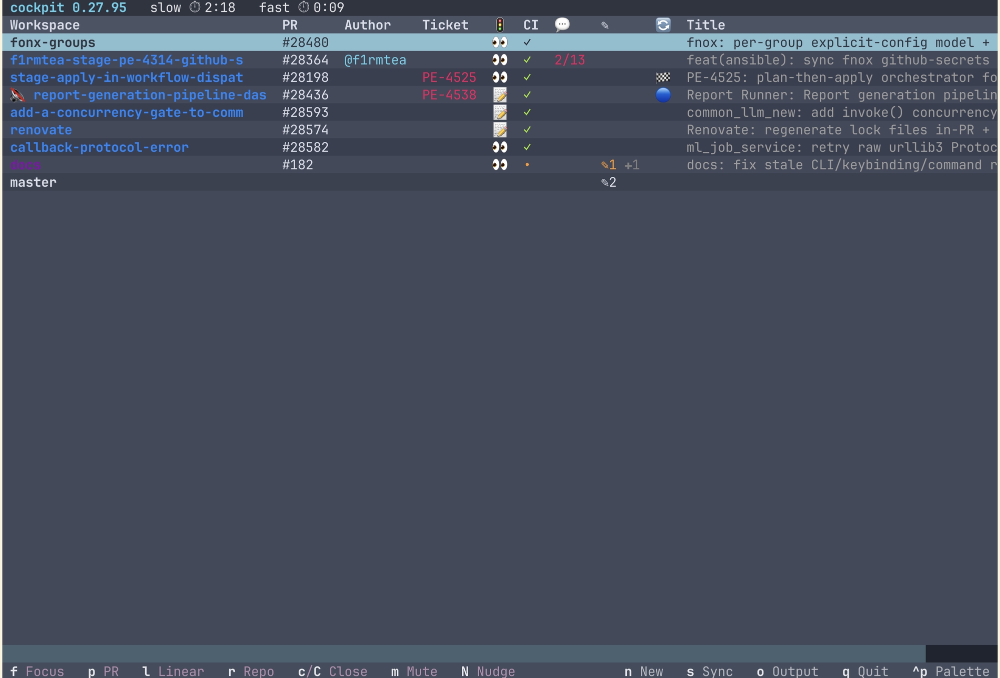

# Features

A tour of everything cockpit does, in the order you'd meet it. [`README.md`](README.md)
is the two-minute version; this is the whole surface. Field-by-field settings live in
[`docs/config.md`](docs/config.md).

Cockpit's whole premise: a change lives in four places at once — a git worktree, a GitHub
PR, a ticket, and usually a Slack thread — and the only thing joining them is you
remembering. Cockpit is that join, and every feature below is one more thing you stop
having to remember.

| | |
|---|---|
| [**The dashboard**](#the-dashboard) | One row per change, every repo. Bands by whose turn it is, indents stacked PRs, parks repos you're not on. [Keys](#keys) |
| [**Starting work**](#starting-work-one-argument-any-source) | One argument — branch, PR, issue, ticket, Slack link, failed CI run — and the worktree, terminal, and context all exist |
| [**The nudge**](#the-nudge) | Your PR goes red, the session gets told. Only when it's genuinely parked, only your own PRs, muteable and snoozeable |
| [**Tickets**](#tickets) | Linear, Jira, GitHub Issues, Trello — live state in the row, a dev-done pill, and the ticket moved on merge |
| [**Auto-review**](#reviewing-your-teams-prs) | A review waiting for you on each coworker PR. Dry-run, collaborators only, never posts on your behalf |
| [**Closing up**](#closing-up) | Refuses to lose work. Merged PRs clean themselves up |
| [**The statusline**](#the-statusline) | Where a session stands without leaving it — budget on one line, the change on the next |
| [**Broadcast**](#reaching-every-session-at-once) | One line into every idle session at once, same safety gate as the nudge |
| [**Config**](#config-that-scales-past-one-repo) | Sane defaults for one repo; an `orgs` block for fifteen |
| [**Design**](#design-decisions-youll-feel) · [**Non-goals**](#what-it-deliberately-doesnt-do) | Why nothing drifts, why it degrades instead of dying, and what it refuses to do |
| [**What it costs**](#what-it-costs) | Where the bookkeeping stops and your judgment starts — the trades you are actually making |

---

## The dashboard

`cockpit watch` gives you one row per change, across every repo you've registered.



**Columns.** Workspace · PR # · `✎` uncommitted files · `🔀` review state · CI · `💬`
comment count · Ticket + `📍` its tracker state · Author · Title · `$` session spend.
The ticket pair appears only when some repo has a tracker configured; `$` only when your
plan actually reports per-session cost — an absent number and a zero are different claims,
so a row that can't tell them apart renders blank rather than lying.

**The row tells you whose turn it is.** `🔔` means this PR has something actionable
waiting on you — failing CI, unresolved review threads, a merge conflict. `🔇` means
muted, and it wins over the bell: a row can't advertise a nudge it won't ring. A snoozed
row carries no glyph at all — it folds away behind `▸ N snoozed`, which says it once for
the group rather than once per row. Rows sort into three bands per repo: your live queue
first, coworkers' PRs you're reviewing next, snoozed ones last. Nothing is configured to
make that happen; it's derived from the same data the row already shows.

**Stacked PRs indent themselves.** GitHub exposes no stack id — the only signal is that
each PR's base branch is the previous PR's head. Cockpit reads that and renders the chain
contiguously under its tip with a `└`, and groups the same chain in your cmux sidebar. No
`gh stack` state in the worktree needed, and it works on a coworker's stack too.

**Park a repo you're not touching this week.** `h` drops it into a `▸ N repos hidden` row: it
stops being polled entirely — no GitHub round-trip, no spawning, no nudges — and its idle
terminals close. It stays in your config, untouched. Starting work there un-parks it
automatically.

**Everything refreshes itself.** A full reconcile every 5 minutes and a network-free
repaint every 30 seconds — both tunable — plus an instant repaint when a workspace opens or
closes out from under you. `s` reconciles every repo on demand. **☰ Menu**, in the top right
corner, opens a palette holding the daemon log, your resolved config, an editor for it, a
theme picker that persists your choice, and a link back to this guide. Click it, or press
`ctrl+p`.

**The top bar also names the repo the highlighted row belongs to**, in that repo's colour.
Every repo heads its own group in the table, but that heading scrolls off the moment a repo
holds more rows than fit — so on any real fleet the row under your cursor tells you nothing
about which repo you're about to act on. The top bar can't scroll away.

### The sidebar card

Every workspace cockpit tracks carries its PR's state as pills in the cmux sidebar —
uncommitted count, unresolved comments, merge conflict, approval, mute — plus the PR
itself: `🟢 PR #332 open ✓`, `⚪ draft`, `🟣 merged`, `🔴 closed`, in GitHub's own colours.

**CI rides that same line**, as a trailing `✓` passing, `✗` failing, `•` pending, `?` errored
— a card has few lines and CI never needs one of its own. A pill has a single colour, so a
build that isn't passing takes it: a failing PR reads red whatever its state. The statusLine
footer has room and keeps CI as its own pill.

**Name the repo when colour runs out.** A workspace is named after its branch, and which
repo it belongs to is carried by the card's tint. That works until you're watching enough
repos to exhaust the sixteen colours cmux offers — and well before that, if several of
yours land on hues that don't read apart at a glance, or if a repo has no colour set at
all. Give the repo a `sidebar_tag` and its workspaces read `infra·fix-retry` instead of
`fix-retry`. It's off unless you set it, so nothing is renamed until you ask; a repo's main
checkout is already named after the repo and never takes one.

**Turn cmux's own PR row off when you use this.** Set `"sidebar": {"showPullRequests":
false}` in `~/.config/cmux/cmux.json` and run `cmux reload-config`. cmux resolves a branch
to a PR itself, and when a branch has carried more than one it can show you the earlier,
closed one — so a reused branch name reads as a dead PR. Cockpit's pill comes from the
open PR it already tracks, so it can't. Left on, you get both numbers on one card.

The trade: cockpit's pill only reaches workspaces it tracks, so a terminal outside your
registered repos shows no PR at all.

### Keys

| Key | Does |
|---|---|
| `f` | Focus this row's terminal — spawning one first if it doesn't have one yet |
| `p` | Open the PR in a browser |
| `t` | Open the linked ticket (Linear / Jira / GitHub / Trello) |
| `d` | Open the PR's diff in cmux's viewer — comment on any line, `a` delivers the notes |
| `a` | Ask — send a line to this row's session, carrying any diff notes; on a repo header, to every session in it |
| `A` | Ask the snoozed — send a line to every session in this repo's snoozed pile, without unfolding it |
| `c` | Close the worktree + terminal |
| `C` | Force close — overrides the open-PR refusal, never the ones that would lose work |
| `m` | Mute / unmute this PR's nudges, indefinitely |
| `z` | Snooze / wake — quiet until the PR actually changes |
| `n` | Start something new |
| `h` | Park / reveal / un-park a repo |
| `s` | Reconcile every repo now |
| `q` | Quit |

Footer hints follow the highlighted row. A row with no PR doesn't advertise `p`; a muted
row's `m` reads **Unmute**; a backend that can't focus doesn't offer `f`. You never press
a key that turns out to be meaningless here. Hovering a key explains it in a sentence —
what it refuses and why, which is the part a one-word label can't carry.

Everything that isn't a key lives behind **☰ Menu** in the top right corner: logs, config,
theme, and this guide. Click it, or press `ctrl+p`.

**The table is also a page of links.** Every cell that names something on the web is a real
terminal hyperlink — ⌘-click it (ctrl-click on Linux) and your browser opens. The PR number,
its review state, the comment count and the title all go to the PR; **CI goes to the checks
page**, because a red ✗ is the thing you want to open, not read; the ticket columns go to
the ticket, in whichever tracker it lives; and an author's `@name` goes to their GitHub
profile. The workspace name, the dirty count and `$` link nowhere — they're about this
machine. Hover any of them and the tooltip tells you where it goes.

This needs a terminal that supports hyperlinks: iTerm2, Ghostty, kitty and WezTerm all do,
Apple's Terminal.app doesn't. `p` and `t` open the PR and the ticket from the keyboard
either way.

**`d` and `a` together are how you review your agent's work.** `d` opens the diff in a
browser split beside that row's terminal; click a line and leave a note. The notes then
ride the next message you send with `a` — the modal tells you how many are going with it,
and opens with a line already written so you can just press enter. The loop is: read the
diff, mark the lines, press `a`, enter. Edit that line when you want to say more, or clear
it to drop the message entirely. They stay local; nothing is posted to the PR, so use `p`
for that. A note is delivered once, and a
message the session refuses (it was mid-turn) keeps its notes for the retry. A row whose
terminal isn't open yet still gets the diff — press `f` first if you want to send anything.

---

## Starting work: one argument, any source

```bash
cockpit new <thing>
```

`<thing>` is auto-detected, and each kind gets a worktree cut, a terminal opened in it,
and a first turn seeded with the context it needs:

| You paste | You get |
|---|---|
| `fix-login` | Branch — checked out if it exists locally or on the remote, created from your base branch if not |
| `#412` or a PR URL | The PR's head fetched into its own worktree, seeded with a plan-first prompt |
| `i#88` or an issue URL | Branch `issue-88`, seeded to read the issue and **rename itself** to the issue's title |
| `PE-1234` or a Linear URL | Branch `you/pe-1234`, seeded to fetch the ticket over MCP and rename itself to the ticket title |
| `PROJ-123` or a Jira URL | Same, via the Atlassian connector |
| A Trello card URL | Same, via the Trello connector |
| A Slack permalink | A codename branch like `you/cosmic-otter`, seeded to read the thread and append a topic slug — `cosmic-otter-fix-oauth` |
| An Actions run URL | Seeded to pull the failing step's logs and work out what broke |
| nothing | Registers the repo you're standing in and opens a terminal in place — no worktree, no branch |

Two extras worth knowing. Append `-- some extra instructions` and it rides along into the
seeded prompt. And `/cockpit-new --context` from inside a Claude session hands the new
workspace a summary of the conversation you're leaving, so it doesn't start cold.

**A ticket key routes itself to the right repo.** `cockpit new PE-1234` finds the repo
declaring that team prefix — free and offline. If several repos share the team (the
many-small-services shape), cockpit resolves the ticket's *project* to break the tie, and
only then, only on the ambiguity, at the cost of one fetch.

**Seeded work is plan-first.** Spawns that inherit real context come up told to study and
propose, not to start editing — the agent waits for your approval. A blank new branch gets
no seeded prompt at all, because there's nothing to study.

---

## The nudge

The feature that makes the dashboard something you *don't* have to watch.

When one of your PRs has something actionable — CI red, unresolved review threads, a merge
conflict — cockpit types a message into that worktree's Claude session telling it what to
fix. You come back to work already in progress.

What makes it safe to leave on:

- **It only speaks into a session genuinely parked at its prompt.** Never mid-turn, and
  never at a pending y/n permission prompt — where typing would answer the prompt rather
  than deliver the message. That distinction is the single fussiest piece of machinery in
  the codebase, and it exists so this feature can be trusted unattended.
- **Only your own PRs.** A coworker's failing CI is not yours to fix, so a review row
  shows the issue and never gets nudged about it.
- **Rate-limited, and quiet on request.** `m` mutes indefinitely. `z` snoozes until the PR
  *actually changes* — new review activity from someone else, or new work appearing — so
  "I've read this, it's their turn" doesn't need a timer you'd have to guess at. Your own
  replies can't wake your own snooze.
- **Quiet stops the nudge, not you.** Snoozed rows fold away behind `▸ N snoozed`, but `A`
  on that fold — or on the repo's header — sends a line to every session in it without
  unfolding first, which is what you want when the answer to a whole pile is the same one.
  Muting and snoozing silence what cockpit decides to say on its own; a message you type
  always goes through. The rows stay snoozed afterwards.
- **`cockpit nudge mute | unmute | list | status | forget`** does the same from a shell.

There's a second nudge for a worktree that has no PR after a few hours: push it or close
it. Grace period is `orphan_nudge_grace_hours`, or `0` to switch it off.

### Keeping stale branches mergeable

If your repo requires branches to be up to date before merging, a PR that was ready an
hour ago stops being mergeable the moment someone else lands on the base. Turn on
`update_stale_branches` and cockpit brings those branches forward for you.

- **Only the PRs nothing is happening on** — approved, or snoozed. Both mean no session is
  mid-turn on that branch. A PR you're actively working on is left alone.
- **Only your own**, like the nudge. A coworker's branch is never rewritten.
- **GitHub does the update, not a local rebase.** It's the same "Update branch" button you
  would click, so a conflict just reports back rather than leaving a half-finished rebase
  in your worktree. If the branch moved since cockpit last looked, the update is refused
  instead of overwriting the push it didn't see.
- **It won't cost you an approval.** If the repo dismisses stale reviews when new commits
  land, updating an approved PR would throw the approval away — so cockpit skips those and
  says why. It checks both classic branch protection and rulesets, and if it can't find
  out, it assumes the worst and leaves the PR alone.
- **Your checkout is put back in sync.** `rebase` (the default) rewrites the branch, so
  cockpit resets the local worktree to match — but only when it's clean and holds nothing
  you haven't pushed. Anything else is left exactly as you had it, with a line in the log.
  Prefer `update_branch_method: merge` and the worktree just fast-forwards.

---

## Tickets

Point a repo at **Linear, Jira, GitHub Issues, or Trello** and the tracker joins the row.

Cockpit reads delivery from one strict footer line in the PR body — `Linear: [PE-1234](…)`,
`Closes #123`, `Jira: [PROJ-123](…)`, `Trello: [title](…)`. Deliberately strict: a branch
name that happens to contain a ticket id, or a passing mention in a comment, is not a
delivery claim.

From that link you get:

- **The ticket and its live state in the table**, and on the workspace card — the real
  title, not just an id. Refetched on a TTL, so it can trail the tracker by up to fifteen
  minutes.
- **A `🏁` dev-done pill** when every ticket the PR delivers has reached your
  dev-done state. Whatever your tracker calls that thing — a Linear state, a GitHub label,
  a Jira status, a Trello list — it's one config field, `dev_done`.
- **`t`** opens the right ticket, in the right tool, without a network call to figure out
  which.
- **Automatic transition on merge**, opt-in per repo (`close_on_merge`). The daemon moves
  the ticket to Done, closes the issue, or slides the card to a list. It only ever touches
  a ticket assigned to *you*, it's idempotent, and it fires independently of whether the
  worktree got cleaned up — so work ships even when the branch sticks around.
- **A "work started" label** on GitHub issues at spawn time, if you want one
  (`start_label`).

Credentials are env vars, always — config stores the *name* of the variable, never a
value. And spawned agents don't get them: an agent reads its tracker through the MCP
connector, so the REST keys are stripped from every spawn's environment.

---

## Reviewing your team's PRs

Set `review_prs: true` on a repo and every coworker PR gets its own worktree and its own
Claude session, seeded with a review command — so a review is waiting for you rather than
queued behind you opening it.

The guardrails are the point:

- **Dry-run, always.** The seeded session reports findings and asks before posting a
  comment or submitting an approve / request-changes verdict. Cockpit never posts on your
  behalf.
- **Collaborators only, by default.** A fork PR's title, body, and diff are
  attacker-controlled, and this spawns a Bash-capable agent. `review_external: true` opts
  in deliberately.
- **Dependabot excluded** unless you ask for it.
- **Review mode all the way down.** A coworker's worktree never gets the commit-and-push
  authority your own PRs' sessions get, and never gets nudged.

Reviews also collect themselves out of your way: they fold into one collapsed
`<org> reviews (N)` group at the bottom of your cmux sidebar, per organisation — one review
queue for a team, however many repos it spans. Snoozed PRs get a second fold below it —
including a whole stacked chain whose tip you snoozed, which gives up its own group and
folds away with the rest of the pile, exactly as the dashboard folds those rows away.

If a fold ever disappears — its header row goes and everything it held spills back into the
sidebar as loose rows — it comes back on its own within about half a minute, rather than
waiting for the next full refresh.

---

## Closing up

`c` on a row, or `cockpit close` from inside the worktree.

**It refuses to lose work.** Uncommitted changes block it. Commits that exist nowhere but
here block it. An open PR blocks it too — that one's soft, and `C` / `--force` overrides
it, but never the other two. Pushing doesn't count as landing: a pushed-but-unmerged
branch keeps its worktree.

The unlanded check is smarter than a diff against main. A cherry-picked commit reads as
landed. Commits belonging to the branch you're *stacked on* don't count as yours. And a
coworker's review worktree only checks for local fixups of your own, since their work is
safe on their remote.

**Merged PRs clean themselves up.** When a PR merges, its worktree and terminal come down
on their own, subject to the same guards.

**Clicking the ✕ on a cmux workspace means the same thing as `c`.** It routes to the same
refusing gate, so a dirty tree survives and tells you why — instead of the terminal simply
reopening on the next cycle, which is what used to happen.

---

## The statusline

Cockpit can drive Claude Code's own statusLine, so a session shows where it stands without
you switching to the dashboard. Budget on the first line, the change on the second:

```text
🤖 Opus 4.7   🧠 7%/1M   ⌛ 4%/5h   khivi/fix-login   ✓ clean
TICKET-123   APPROVED   #9999   ✓   Add login flow
```

Model, context headroom, rate-limit budget, session cost, repo, branch, dirty state,
permission mode, ticket, review state, PR number, comments, CI, title. Drop any of them
with `statusline_hide`. Set `use_cship: true`, or accept the prompt during `cockpit setup`.

---

## Reaching every session at once

```bash
cockpit broadcast /compact      # --dry to preview
```

One line of text into every idle Claude session cockpit knows about. Same idle gate as the
nudge, so a session mid-turn or sitting on a permission prompt is skipped and named, never
interrupted. Handy for `/compact` across the board, or telling every session about a
decision you just made.

`/cockpit-new`, `/cockpit-close`, and `/cockpit-broadcast` are installed into Claude Code
by `cockpit setup`, so you can drive all three from inside a session.

---

## Config that scales past one repo

Watching one big repo needs almost nothing — `cockpit new` registers repos for you, and
every setting has a working default.

Watching fifteen small services owned by one team needs the **`orgs` block**: a named
bundle of per-repo defaults. Declare colour, branch prefix, ticket provider, credential
variable, and review policy once; every member repo inherits it. A repo can still override
any single field. Its repos render adjacent in the table, share one sidebar tint, and share
one review fold — and separate orgs on separate Linear workspaces each get their own
credential, because the config stores env var *names*.

Mistyped settings hard-fail at startup with the valid options listed, rather than silently
doing nothing. So do settings renamed in past versions — an ignored setting is a feature
that goes dark without telling you.

---

## Design decisions you'll feel

Underneath, cockpit asks exactly one question per worktree, once a cycle: **does anything
need to happen here?** Three sources answer it — GitHub (is there a PR, is it open, is CI
green, are threads unresolved?), your terminal backend (is a session open here, and is it
idle or mid-turn?), and git (does the worktree exist, is it dirty, how far behind its
base?). Cross those and exactly one path applies: spawn a workspace, nudge the agent, write
a pill, tear the worktree down, or do nothing. Most cycles it is nothing.

Four consequences you'll actually notice:

**Nothing is stored, so nothing drifts.** All three sources are re-derived from scratch
every cycle. There's no identity file to get out of sync with reality, which is why a row
can't tell you about a worktree that isn't there or a PR state from twenty minutes ago. The
one exception is ticket state. A ticket can move without anything in the PR changing, so the
delivery block is cached and refetched when the PR's footer ids change or after
`linear_state_ttl_seconds` (three slow ticks by default). It is the only field in the table
that can be up to fifteen minutes behind.

**One writer.** The daemon decides and writes; the table and statusline only read. A
renderer that went and asked `git` itself could disagree with the field beside it in the
same render — that's the bug class this eliminates, and it's why two surfaces never tell
you different things about one PR.

**It degrades instead of dying.** No terminal backend? The table and statusline still work;
nothing can be spawned. Backend too old for a verb? A warning at startup naming what's
lost, not a crash. GitHub unreachable for a cycle? Cockpit suspends the decisions that
would be irreversible rather than acting on a partial picture.

**It fails safe.** Every refusal above defaults to keeping your work. Every write to an
external system — a ticket transition, a review comment — is either opt-in, gated to
things assigned to you, or requires you to say yes.

---

## What it costs

Everything above removes bookkeeping. None of it removes judgment, and the difference is
worth being explicit about.

**The bottleneck moves, it doesn't clear.** Ten rows produce ten diffs, and you read diffs
at the speed you always have. Cockpit removes lookup, not review. Five to ten live rows is
honest; fifty is a review queue you're lying to yourself about.

**Nothing stored means no history.** The rule that keeps the table from drifting also means
it can't tell you what changed since yesterday. Every row is what is true right now. For the
arc of a change, go read the PR.

**A nudged session digs.** Red CI at 2am gets fixed while you're asleep, and once in a while
it gets fixed by weakening the test. The nudge buys a shorter path to the review, never a
shorter review — and sometimes it buys work you throw away. `m` and `z` exist for the
branches where that trade isn't worth taking.

**The backend is yours to install.** Cockpit drives terminals; it doesn't ship them. Without
cmux or limux on `PATH`, the table and statusline still work and nothing can be spawned.

**One human's attention is the ceiling.** Every refusal in this document exists to keep a
decision in front of you. If what you want is a queue that runs itself overnight without
you, this is the wrong tool.

---

## What it deliberately doesn't do

- **It doesn't orchestrate agents.** It doesn't plan work, split it up, assign it, or
  decide anything. You do that. What it takes off you is the clerical half of working on
  several things at once.
- **It doesn't post for you.** No auto-approvals, no auto-comments, no auto-merges.
- **It doesn't self-update.** `brew upgrade cockpit` — no in-process update check, no
  version nag in the UI.
- **It doesn't phone anywhere.** git, `gh`, your terminal backend, and — only if you
  configure a tracker — that tracker's API.

---

Ready to try it? [`README.md`](README.md#install) has install and first run.
Every setting: [`docs/config.md`](docs/config.md). How the daemon actually decides things:
[`docs/state-machine.md`](docs/state-machine.md).
