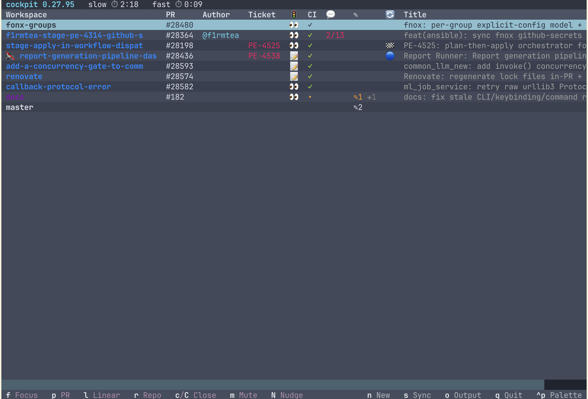

# Features

This is the user guide to cockpit. [`README.md`](README.md) covers install and first run.
Every setting is in [`docs/config.md`](docs/config.md).

A change lives in four places at once: a git worktree, a GitHub PR, a ticket, and often a
Slack thread. Cockpit joins them, so you stop keeping track of them yourself.

| | |
|---|---|
| [**The dashboard**](#the-dashboard) | One row per change, across every repo, sorted by whose turn it is |
| [**Keys**](#keys) | The keymap, the clickable table, and reviewing with `cockpit diff` |
| [**Starting work**](#starting-work-one-argument-any-source) | One argument — branch, PR, issue, ticket, Slack link, failed CI run — gives you a worktree, a terminal, and a briefed agent |
| [**The nudge**](#the-nudge) | When your PR goes red, the agent is told to fix it |
| [**Tickets**](#tickets) | Linear, Jira, GitHub Issues and Trello in the table, plus an inbox of work you haven't started |
| [**Reviewing**](#reviewing-your-teams-prs) | A review waiting for you on each coworker PR, never posted without you |
| [**Closing up**](#closing-up) | Close a worktree without losing work. Merged PRs clean themselves up |
| [**The statusline**](#the-statusline) | See where a session stands from inside it |
| [**Broadcast**](#reaching-every-session-at-once) | Send one line to every idle session |
| [**Config**](#config-that-scales-past-one-repo) | Defaults for one repo, and an `orgs` block for many |
| [**Limits and trade-offs**](#limits-and-trade-offs) | What it costs you, and what it won't do |

---

## The dashboard

Run `cockpit watch`. You get one row per change, across every repo you've registered.



**Columns.** Workspace · PR # · `✎` uncommitted files · `🔀` review state · CI · `💬`
review threads · Ticket and `📍` its state · Author · Title · `$` session spend.

- `💬` is red `N/T` while threads wait on you, and green `0/T` once you've handled them all.
- The ticket columns appear only when a repo has a [ticket tracker](#tickets) configured.
- `$` appears only when your plan reports per-session cost. A blank means "not reported",
  not zero.

**The row tells you whose turn it is.**

- `🔔` — this PR needs you: failing CI, open review threads, or a merge conflict.
- `🔇` — you muted it. Mute wins over the bell.
- Snoozed rows fold away behind a `▸ N snoozed` row at the bottom of their repo.

Each repo sorts into three bands: your own queue first, then coworkers' PRs you're
reviewing, then snoozed PRs.

**Stacked PRs indent under their tip** with a `└`, and the same chain is grouped in your
cmux sidebar. This works on a coworker's stack too. A stack snoozes as one unit: `z` on
any row quiets the whole chain, and a comment on any member wakes it.

**Park a repo you aren't working on.** Press `h` on its header. It moves into a
`▸ N repos hidden` row and goes quiet: no polling, no new workspaces, no nudges, and its
idle terminals close. It stays in your config. Press `h` again to bring it back, or just
start work there — that un-parks it.

**It keeps itself fresh.** A full refresh runs every 5 minutes and a quick local one every
30 seconds; both are tunable. Opening or closing a workspace refreshes the table at once.
Press `s` to refresh every repo now.

**The top bar** shows, left to right:

- the version you're running, linked to its release notes;
- the repo of the highlighted row, in that repo's colour — useful once the repo's own
  header has scrolled off screen;
- two countdowns: 🐢 to the next full refresh, 🐇 to the next quick one (hover for which is
  which);
- **≡ Menu**.

**≡ Menu** (or `ctrl+p`) holds the daemon log, your resolved config, an editor for it, a
theme picker, this guide, and the release notes. After an upgrade, cockpit tells you once
on first launch and points you at the release notes.

### The sidebar card

Each workspace card in the cmux sidebar shows its PR's state as pills: uncommitted files,
unresolved comments, merge conflict, approval, and mute. The PR itself reads like
`🟢 PR #332 open ✓`, `⚪ draft`, `🟣 merged` or `🔴 closed`, in GitHub's colours.

CI is the trailing mark on that line: `✓` passing, `✗` failing, `•` pending, `?` errored.
A build that isn't passing turns the whole pill its colour, so a failing PR reads red.

**cmux's own PR row is turned off for you.** `cockpit setup` sets
`"sidebar": {"showPullRequests": false}` in `~/.config/cmux/cmux.json` and reloads cmux, so
one card never shows two PR numbers. `cockpit teardown` turns it back on. Cockpit's pill
only appears on workspaces it tracks, so a terminal outside your registered repos shows
no PR.

**Tag repos when colours run out.** Workspaces are named after their branch, and the card's
tint tells you the repo. Past a handful of repos, the tints stop being distinguishable. Set
a [`sidebar_tag`](docs/config.md) and the workspace reads `infra·fix-retry`. An emoji tag
takes a space instead of the dot: `🎛️ fix-retry`.

Tags also label group headers. A stack's header wears its repo's tag. The two piles at the
bottom of the sidebar are named after their org — `Some Long Org snoozed (11)` — and a tag
set on the org replaces that name: `♻️ snoozed (11)`. Use `{repo}` in an org's tag to get
both: each workspace named after its own repo, and the shared glyph on the piles.

---

## Keys

| Key | Does |
|---|---|
| `f` | Focus this row's terminal, opening one if it has none |
| `p` | Open the PR in your browser |
| `t` | Open the linked ticket (Linear / Jira / GitHub / Trello) |
| `a` | Ask — send a line to this row's session; on a repo header, to every session in the repo |
| `A` | Ask every session in this repo's snoozed pile, without unfolding it |
| `c` | Close the worktree and terminal |
| `C` | Force close — skips the open-PR check, never the checks that protect your work |
| `m` | Mute / unmute this PR's nudges |
| `z` | Snooze / wake — quiet until the PR changes |
| `n` | Start something new |
| `T` | The ticket inbox — tickets assigned to you that you haven't started |
| `h` | Park / reveal / un-park a repo |
| `s` | Refresh every repo now |
| `q` | Quit |

The footer shows only the keys that make sense for the highlighted row. A row with no PR
doesn't offer `p`, and a muted row's `m` reads **Unmute**. Hover a key for a one-line
explanation. Everything else is in **≡ Menu**.

**Asking a busy session.** `a` never types into a session that is mid-turn or waiting on a
prompt — your line could answer a permission question by accident. If the session is just
busy, cockpit queues the line and sends it as soon as the session is free. The toast says
why it waited. If it says `Needs input`, the session may be waiting on you. A queued line
expires after ten minutes. If the session is not reachable at all, your draft is kept for
the next `a`.

**Click through the table.** Cells that name something on the web are links: ⌘-click
(ctrl-click on Linux) to open them.

- PR number, review state, comments and title → the PR.
- CI → the PR's checks page.
- Ticket columns → the ticket.
- `@author` → their GitHub profile.

Hover any cell to see where it goes. Links need a terminal that supports them — iTerm2,
Ghostty, kitty and WezTerm do; Apple's Terminal.app doesn't. `p` and `t` work everywhere.

### Reviewing your agent's work with `cockpit diff`

Read the diff in the session's own terminal, not on the dashboard:

```bash
cockpit diff              # the PR diff; with no PR, the branch diff
                          #   (or uncommitted changes on main/master)
cockpit diff --branch     # or pick one: --branch, --staged, --unstaged,
cockpit diff --staged     #   --last-turn (what the agent changed in its last turn),
cockpit diff --last-turn  #   --base to change what --branch compares against
cockpit diff --comments   # read the notes left on this work
cockpit diff --ack        # mark them done
```

The diff opens as a full-width tab next to your terminal. Click a line to leave a note.
Switch back to the terminal tab when you're done.

**The agent picks up your notes by itself.** Within about 30 seconds, cockpit hands the
notes to the session in that worktree. It addresses them, then runs `--ack`, which also
closes the diff tab. A note the agent can't act on stays open rather than disappearing.

This happens only when the session is idle at its prompt. Mute and snooze don't stop it —
these are your own notes, not cockpit nagging. Each batch is sent once; new notes send
again.

The `📝` column counts notes not yet addressed, so you can see which session hasn't got to
them. Notes stay on your machine and never reach the PR — use `p` to comment there.

`cockpit diff` works in any git repo, registered or not. There is no diff key on the
dashboard: you review from inside the workspace.

---

## Starting work: one argument, any source

```bash
cockpit new <thing>
```

Cockpit works out what `<thing>` is. Each kind gets a worktree, a terminal in it, and a
first prompt with the context the agent needs:

| You give it | You get |
|---|---|
| `fix-login` | That branch — checked out if it exists, created from your base branch if not |
| `#412` or a PR URL | The PR in its own worktree, with a plan-first prompt |
| `i#88` or an issue URL | Branch `issue-88`, told to read the issue and rename itself after it |
| `PE-1234` or a Linear URL | Branch `you/pe-1234`, told to fetch the ticket and rename itself after it |
| `PROJ-123` or a Jira URL | The same, through the Atlassian connector |
| A Trello card URL | The same, through the Trello connector |
| A Slack permalink | A codename branch like `you/cosmic-otter`, told to read the thread and add a topic — `cosmic-otter-fix-oauth` |
| A GitHub Actions run URL | Told to read the failing step's logs and work out what broke |
| nothing | Registers the repo you're in and opens a terminal there — no worktree, no branch |

Press `n` on the dashboard to do the same from a picker.

**Add instructions.** Append `-- some extra instructions` and they go into the first
prompt.

**Carry context from a conversation.** Inside a Claude session, `/cockpit-new --context`
gives the new workspace what it needs from the current conversation: the goal, decisions
made, approaches ruled out, and the exact PRs, tickets and paths. It leaves out anything
the new session can read from the repo itself. Give it a value —
`--context 'the auth refactor'` — to focus what it carries.

**Tickets find their repo.** `cockpit new PE-1234` goes to the repo that declares the `PE`
team key. If several repos share that team, cockpit checks the ticket's project to pick
one. If it still can't choose, it asks.

Trello cards route by **board**: set `tickets.board` and a card goes to the repo that owns
its board. When two repos share a board, set `tickets.label` on one of them. Cards with
that label go there; everything else goes to the repo with no label. Cards keep moving
through your normal lists either way.

**Agents plan before they code.** A workspace started with real context comes up told to
study and propose a plan, then wait for your approval. A plain new branch gets no prompt.
The plan is also saved to `plan.md` in the worktree, so you can read it without opening the
session, and it survives a crash or a close. Don't commit it.

**The first prompt always arrives.** Cockpit checks that the prompt reached the new session
and resends it once the session is ready. If it can't deliver it within a few minutes, it
drops it rather than type a "fresh task" prompt into work you've already started.

---

## The nudge

When one of your PRs has failing CI, open review threads, or a merge conflict, cockpit
tells that worktree's Claude session what to fix. You come back to work already in
progress.

It is safe to leave on:

- **It only speaks to a session that is idle at its prompt** — never mid-turn, and never at
  a permission prompt.
- **Only your own PRs.** A coworker's PR shows its problems in the row but is never nudged.
- **You can quiet it.**
  - `m` mutes a PR indefinitely.
  - `z` snoozes it until the PR changes: someone else comments or reviews, or there's new
    work to do. Your own replies don't wake it. On a coworker's PR you're reviewing, a new
    push wakes it too.
- **Quiet only stops cockpit, not you.** Lines you type with `a` or `A` always go through.
  `A` on the snoozed pile sends one line to every session in it; the rows stay snoozed.

From a shell, `cockpit nudge mute | unmute | snooze | wake | list | status | forget` does
the same for one PR, so a session can quiet its own PR. In a stack, the row only moves
when the stack's tip is snoozed; the command tells you which PR that is. Use `z` on the
dashboard to snooze the whole chain. Running `snooze` again refreshes the row if the
screen looks out of date.

### Keeping stale branches mergeable

If your repo requires branches to be up to date before merging, a ready PR becomes
unmergeable as soon as something else lands. Turn on `update_stale_branches` and cockpit
updates those branches for you.

- **Only PRs nobody is working on** — approved or snoozed.
- **Only your own.** A coworker's branch is never touched.
- **GitHub does the update**, as if you'd clicked "Update branch". A conflict is reported,
  never left half-done in your worktree. If the branch moved since cockpit last looked, it
  doesn't update.
- **It never costs you an approval.** If new commits would dismiss an approval, cockpit
  skips that PR and logs why. If it can't tell, it skips.
- **Your local checkout follows.** With `rebase` (the default), cockpit resets your
  worktree to the updated branch — but only if it's clean and fully pushed. Otherwise it
  leaves it alone and logs a line. With `update_branch_method: merge`, the worktree just
  fast-forwards.

---

## Tickets

Point a repo at **Linear, Jira, GitHub Issues, or Trello** and tickets join the dashboard.
That tool is the repo's *ticket tracker*. Each repo has at most one, and with none set the
ticket columns, pills and inbox stay off.

**Set it up** with a `tickets` block on the repo in `~/.config/cockpit/config.json`. Put it
on an [`orgs`](docs/config.md) block instead to cover every repo of a team at once.

| Tracker | Minimal block | Credential env vars |
|---|---|---|
| GitHub Issues | `{"provider": "github"}` | none, uses `gh` |
| Linear | `{"provider": "linear", "keys": ["PE"]}` | `LINEAR_API_KEY` |
| Jira | `{"provider": "jira", "keys": ["PROJ"], "site_url": "https://you.atlassian.net", "email": "you@example.com"}` | `JIRA_API_TOKEN` |
| Trello | `{"provider": "trello", "board": "Engineering"}` | `TRELLO_API_KEY`, `TRELLO_API_TOKEN` |

`keys` is the ticket-id prefix (`PE` in `PE-1234`). `board` names the Trello board this
repo's cards live on. Cockpit warns at start when a credential variable is unset. Every
other field, such as `dev_done` and `close_on_merge`, is in
[`docs/config.md`](docs/config.md#tickets-block).

A PR delivers a ticket through one footer line in its body: `Linear: [PE-1234](…)`,
`Closes #123`, `Jira: [PROJ-123](…)`, or `Trello: [#122 title](…)`. A ticket id in a branch
name or a comment doesn't count.

With that line in place you get:

- **The ticket and its state** in the table and on the sidebar card, by the handle you'd
  say out loud — `PE-1234`, `PROJ-45`, `#123`, or a Trello card's `#122`. State can lag the
  tracker by up to fifteen minutes.
- **A `🏁` dev-done pill** once every delivered ticket reaches your "done" state. Set what
  that means for your tracker in `dev_done`: a Linear state, GitHub label, Jira status, or
  Trello list.
- **`t`** opens the ticket in the right tool.
- **Tickets move on merge**, if you turn on `close_on_merge`. Cockpit moves the ticket to
  Done, closes the issue, or moves the card. It only touches tickets assigned to you.
- **A "work started" label** on GitHub issues when you start one (`start_label`), if you
  want it.
- **The agent knows where to file tickets.** A new session is told its repo's tracker and
  team, project or board. `cockpit config tickets` prints the same from any worktree.
  Using two Linear workspaces? Register an MCP server for each and set `mcp_server` on each
  org.

Credentials always come from environment variables; config holds only the variable's
name. Agents don't receive them — they read the tracker through their MCP connector.

### The ticket inbox — press `T`

The dashboard shows work you've started. `T` shows the rest: tickets assigned to you, in an
active state, with no worktree yet. They're grouped by org, newest first.

```text
┌─ Tickets ─────────────────────────────────────┐
│ 3 assigned to you, with no worktree yet       │
│ ▾ acme (2)                                    │
│   PE-412   Fix retry backoff    starting…  2d │
│ ? PE-430   Docs pass on the api    Progress 6h│
│ ▸ widgets-co (1)                              │
│                                               │
│ enter opens an org or starts a ticket · c     │
│ checks this org's setup · esc to close        │
│ ? several repos claim it — enter picks one    │
└───────────────────────────────────────────────┘
```

**Using it:**

- `enter` on an org opens or closes it. Orgs start closed, unless there is only one.
- `enter` on a ticket starts it, exactly as `cockpit new <ticket>` would. The row shows
  `starting…` and the inbox stays open, so you can start several. It leaves the list once
  its worktree appears on the dashboard.
- `t` opens the ticket in your browser.
- `c` checks the org's tracker setup (see below).
- `esc` closes the inbox.

**Where will it land?** Most tickets go to exactly one repo and show no mark.

- `?` — several repos claim it. `enter` asks you to pick one.
- `!` — no repo claims it. Start it with `n` and choose the repo yourself.

**What's listed:**

- Tickets assigned to you in an active state, such as Todo or In Progress. Backlog,
  triage, finished work, and anything in your `dev_done` or `merge_done` state are left
  out.
- If your team works from Backlog, or the default reads your workflow wrong, set
  `tickets.inbox_states` to the exact states you want. Linear names are case-sensitive;
  Jira and Trello aren't. GitHub issues have no states, so the setting doesn't apply there.
- Only the teams, boards and repos your config names. Trello requires `tickets.board` (one
  board or a list); without it, no Trello cards appear.
- Nothing from archived Trello boards.
- If a tracker can't be reached, the org keeps its last list rather than going empty.

**Why is an org empty?** Press `c`. Cockpit checks each repo in the org and reports what
it finds:

```text
widgets
  provider: linear
  credential ACME_LINEAR_KEY: set
  connection: ok
  scope: PE, PLAT
  scope names: FAIL — the tracker knows no PLAT
  mcp server: linear-acme
  mcp reachable: connected
```

- Credentials are shown by variable name, never by value.
- If the connection fails, scopes aren't checked — the connection is the problem to fix
  first.
- `mcp reachable` reports what Claude Code says about the server. "Not listed" is a hint,
  not proof: a claude.ai connector can show as missing while it's working.
- On an empty inbox, `c` checks every org.
- A spinner shows which repo is being checked. `esc` cancels and shows no report.

The inbox needs no setup beyond your `tickets` config. It appears when any repo has a
tracker.

---

## Reviewing your team's PRs

Set `review_prs: true` on a repo. Every coworker PR then gets its own worktree and Claude
session, already reviewing it when you arrive.

- **Nothing is posted without you.** The session reports its findings and asks before it
  comments, approves, or requests changes.
- **Collaborators only.** A PR from a fork is untrusted input for an agent that can run
  commands. Set `review_external: true` only if you accept that.
- **No Dependabot**, unless you set `"dependabot": true`.
- **Review sessions stay reviewers.** They never get commit-and-push rights on the branch,
  and they are never nudged.

In the cmux sidebar, reviews collect into one collapsed `<org> reviews (N)` group at the
bottom, one per org however many repos it spans. Snoozed PRs collect into a second group
below it, including whole snoozed stacks. If one of these groups disappears, it comes back
within about 30 seconds.

---

## Closing up

Press `c` on a row, or run `cockpit close` inside the worktree. Clicking ✕ on a cmux
workspace does the same.

**It won't lose your work.** Cockpit refuses to close when:

- the worktree has uncommitted changes;
- it has commits that exist nowhere else — pushed but unmerged still counts;
- the PR is still open.

`C` or `--force` overrides only the open-PR check. When cockpit refuses, it tells you why.

Cherry-picked commits count as landed, and commits from a branch you're stacked on aren't
counted as yours. On a coworker's review worktree, only your own local commits block it.

**Merged PRs clean up on their own.** When a PR merges, its worktree and terminal close,
with the same checks.

---

## The statusline

Cockpit can drive Claude Code's statusLine, so a session shows where it stands without
switching to the dashboard. Budget on the first line, the change on the second:

```text
🤖 Opus 4.7   🧠 7%/1M   ⌛ 4%/5h   khivi/fix-login   ✓ clean
TICKET-123   APPROVED   #9999   ✓   Add login flow
```

Model, context used, rate-limit budget, session cost, repo, branch, uncommitted state,
permission mode, ticket, review state, PR number, comments, CI, and title. Hide any of them
with `statusline_hide`. Turn it on with `use_cship: true`, or accept the prompt in
`cockpit setup`.

---

## Reaching every session at once

```bash
cockpit broadcast /compact                        # --dry to preview
cockpit broadcast --repo svc-auth /compact        # one repo's sessions
cockpit broadcast --worktree ~/src/fix /compact   # one worktree's session
```

Sends one line to every idle Claude session cockpit can see. Sessions that are busy or at a
permission prompt are skipped and listed. Use it to `/compact` everything, or to tell every
session about a decision.

- `--repo` takes the repo name as the dashboard shows it, in any case. An unknown name
  lists the valid ones instead of sending anywhere.
- `--worktree` targets exactly the session in that directory — handy for trying a command
  on one session before sending it everywhere.

`cockpit setup` installs `/cockpit-new`, `/cockpit-close`, `/cockpit-broadcast`,
`/cockpit-nudge` and `/cockpit-diff` into Claude Code, so you can run all of these from
inside a session. `/cockpit-diff apply` works through the notes left in the diff viewer;
cockpit usually sends it for you.

---

## Config that scales past one repo

One repo needs almost no config: `cockpit new` registers repos for you, and every setting
has a working default.

Many repos owned by one team call for an **`orgs` block**: shared defaults for colour,
branch prefix, ticket provider, credential variable, and review policy. Every member repo
inherits them, and any repo can override a single field. An org's repos sit together in the
table, share a sidebar tint, and share one review group. Each org can use its own tracker
credentials.

To see what a repo actually resolved to, run `cockpit config inspect`. It prints the
merged config as JSON. `--repo NAME` narrows it to one repo and adds its ticket provider and
the credential variables it needs, each marked set or unset.

A mistyped or retired setting stops cockpit at startup and lists the valid options, so a
setting never silently does nothing.

**GitHub Enterprise works alongside github.com** with nothing to configure — each repo uses
the host from its own `origin`. Run `gh auth login --hostname <your-host>` first. If you
forget, cockpit warns at startup; otherwise that repo would just look like it has no PRs.

---

## Limits and trade-offs

Cockpit takes the bookkeeping off you. It doesn't take the judgment.

- **Review is still on you.** Ten rows means ten diffs to read. Five to ten live rows is
  realistic; fifty is a queue you won't get through.
- **No history.** Each row shows what's true now, not what changed since yesterday. The PR
  has the history.
- **A nudged agent may take shortcuts.** Red CI at 2am gets fixed while you sleep — and
  occasionally by weakening a test. Read what it did. Use `m` and `z` where that isn't
  worth it.
- **You bring the terminal.** Cockpit drives cmux or limux; it doesn't install them.
  Without one, the table and statusline still work, but nothing can open a terminal.
- **It doesn't orchestrate agents.** It doesn't plan, split, assign, or decide work. If you
  want a queue that runs overnight without you, this is the wrong tool.
- **It doesn't post for you.** No auto-approvals, auto-comments, or auto-merges.
- **It doesn't update itself.** Run `brew upgrade cockpit`. It never checks for newer
  versions; it only tells you when the version you're running has changed.
- **It doesn't phone home.** It talks to git, `gh`, your terminal, and — if you set one up —
  your tracker.

---

Ready to try it? [`README.md`](README.md#install) has install and first run. Every setting:
[`docs/config.md`](docs/config.md).
