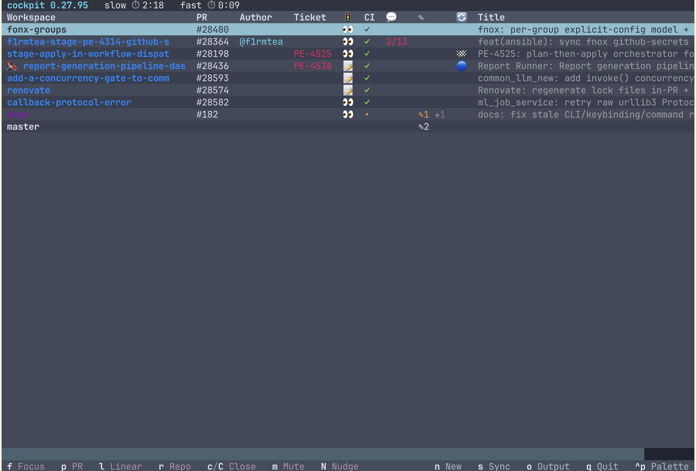

# Cockpit

[](https://github.com/khivi/cockpit/actions/workflows/ci.yml) [](LICENSE)

A terminal UI for running several Claude Code agents at once. Each task gets its own git worktree, a `cmux`/`limux` terminal running `claude`, and a GitHub PR — cockpit shows them all in one live table (CI, reviews, comments, dirty state) you drive by keystroke.



One worktree per task scales the *work*, not the *tracking*: a few parallel tasks and you have N terminals, N PRs, and N tickets with nothing tying them together. Cockpit re-derives the whole fleet every cycle from git + cmux + GitHub — no stored state to drift — and closes the loop the other way: spawn a worktree + session + PR-tracking row from a branch, PR, ticket, or Slack thread (`cockpit new`), and tear it down when the PR merges.

## Requirements

- `git ≥ 2.30`, [`gh`](https://cli.github.com/) (authenticated), Claude Code
- A workspace backend on `PATH` — spawns/focuses a per-worktree terminal. Without one, cockpit runs cache-only (footer/statusline work; spawning disabled):
  - [`cmux`](https://github.com/manaflow-ai/cmux) — macOS: `brew install --cask cmux`
  - [`limux`](https://github.com/am-will/limux) — Linux port ([releases](https://github.com/am-will/limux/releases) / AUR `limux-bin`); spawns/closes but lacks cmux's focus/pill/color verbs
- Optional statusline: [`cship`](https://github.com/stephenleo/cship) + [`starship`](https://starship.rs/) — `curl -fsSL https://cship.dev/install.sh | bash`, then `use_cship: true`

## Install

```bash
brew tap khivi/cockpit
brew install cockpit
cockpit setup
```

Or, any platform with Python 3.12+ (PyPI dist is `cmux-cockpit`; the command stays `cockpit`):

```bash
pipx install cmux-cockpit   # or: uv tool install cmux-cockpit
cockpit setup
```

`cockpit setup` wires the idle hooks + `/cockpit-new`/`/cockpit-close` commands into `~/.claude/`, and (interactive on a TTY) offers the optional statusline. Idempotent. Update with `brew upgrade cockpit`. Coming from the old Claude Code plugin? See [`MIGRATION.md`](MIGRATION.md).

## Use

Start a task (auto-registers the repo), then open the dashboard:

```bash
cockpit new <branch | PR | url>   # or press `n` in the TUI; full flags: cockpit new --help
cockpit watch                     # needs a TTY; run under tmux/cmux to persist
```

`url` auto-detects a GitHub PR URL, an Actions run URL, or a Slack permalink.

Drive the table by keystroke — footer hints adapt to the highlighted row's state, its workspace, and your backend:

| Key | Action |
|---|---|
| `f` | Focus the row's workspace (spawns one first if it has none) |
| `p` | Open the PR in a browser |
| `t` | Open the linked ticket (Linear/GitHub/Jira/Trello) |
| `c` / `C` | Close / force-close (refuses dirty/unpushed/open-PR; `C` overrides the open-PR block) |
| `m` | Mute / unmute the row's nudge |
| `N` | Nudge the row now (honours the idle gate) |
| `n` | New workspace (branch / PR / URL / ticket / Slack thread) |
| `s` / `o` / `q` | Sync · show logs · quit |

## Configuration

`~/.config/cockpit/config.json` holds managed repos + tunables; `cockpit new` auto-registers repos. Minimal:

```json
{"repos": [{"name": "myrepo", "path": "/abs/path", "branch_prefix": "you/", "default_base": "main"}]}
```

Everything else has a sane default. Full field reference: [`docs/config.md`](docs/config.md) (and [`cockpit/config.example.json`](cockpit/config.example.json)). Two features worth knowing:

- **Tickets** — link each PR to Linear / Jira / GitHub Issues / Trello via a body footer, and transition the ticket on merge (per-repo `tickets`).
- **Auto-review** — `review_prs: true` spawns a review agent per coworker PR (collaborators only; `review_external` opts in fork PRs — untrusted content reaching a Bash-capable agent, so enable deliberately).

Only the statusline is prompted for at `cockpit setup` (it installs binaries); every other setting is a plain `config.json` edit, validated at startup.

## Statusline (optional)

```text
🤖 Opus 4.7   🧠 7%/1M   ⌛ 4%/5h   khivi/fix-login   ✓ clean
TICKET-123   APPROVED   #9999   ✓   Add login flow
```

## Uninstall

```bash
cockpit teardown          # remove the ~/.claude statusLine/hooks/commands (do this before uninstall)
rm -rf ~/.config/cockpit  # state only; your worktrees remain
brew uninstall cockpit
```

## License

MIT — see [LICENSE](LICENSE). Contributing? Read [`CONTRIBUTING.md`](./CONTRIBUTING.md).
