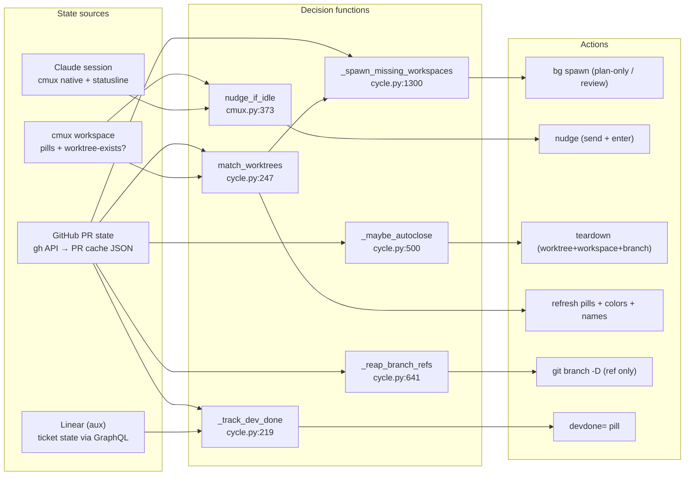
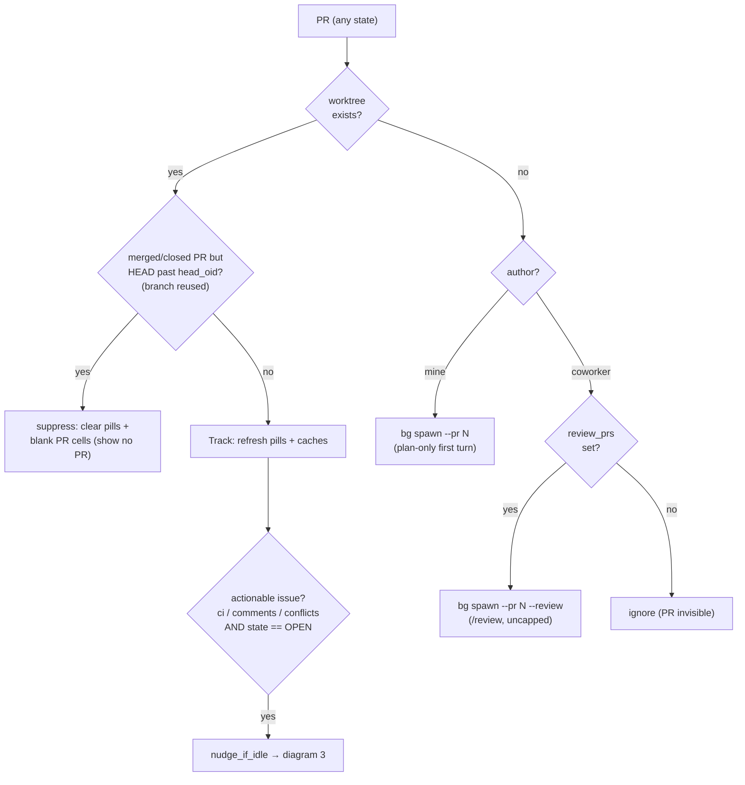
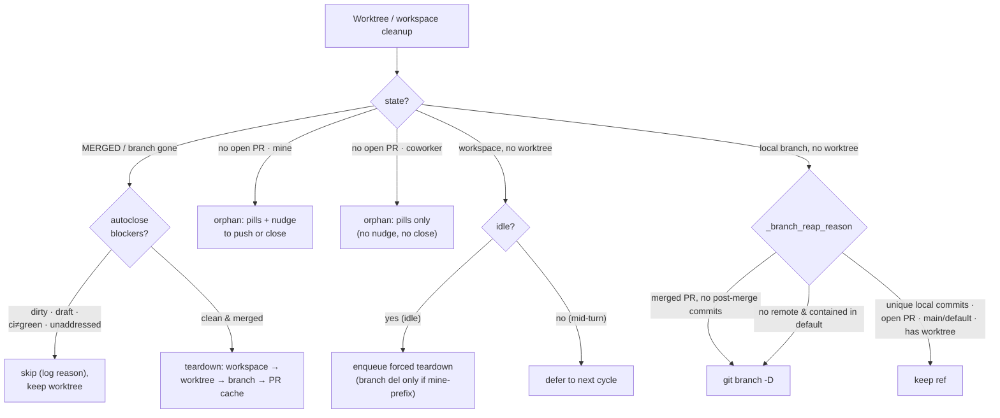
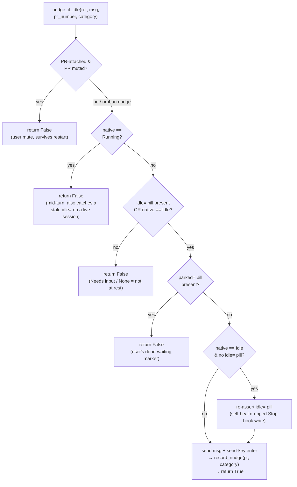
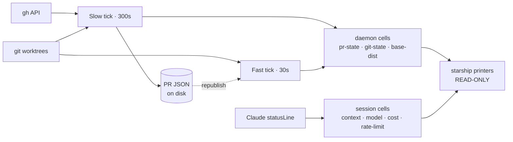

# Cockpit state machine

Cockpit combines **three independent state vocabularies** (plus an auxiliary
Linear read) into per-workspace decisions. No single source file shows the
combination layer — this document does. Diagrams are
[Mermaid](https://mermaid.js.org/) and render on GitHub.

## The state sources

| Source | Lives in | Values |
|---|---|---|
| **GitHub PR** | `gh` API → PR cache JSON (`cache.py`) | `state` ∈ {`OPEN`,`MERGED`,`CLOSED`} × `ci` × `unaddressed` × `review_decision` × `isDraft` × `mergeable` |
| **Claude session** | cmux native `claude_code=` + statusline stdin (`claude.py`) | `Running` / `Idle` / `Needs input`; context %, rate-limit, model, cost |
| **cmux workspace** | cmux pills + in-memory `pill_state` dict | `idle=` `devdone=` `parked=` `ci=` `comments=` `merge=` `wip=` `draft=` `approved=` `stale=` `loop=` + *does a worktree exist?* |
| **Linear** (aux) | `gh`-style GraphQL via `LINEAR_API_KEY` (`linear.py`) | ticket workflow `state.name` (e.g. `Dev Done`) — read-only, only for the `devdone=` pill |

The decision functions consume these and emit actions. Everything below is a
drill-down of one node in the orientation map.

---

## 1. Orientation map (L0)

How the state sources feed the decision functions, and what each emits.

The renderer (`starship.py`) is **not** in this picture by design: it only reads
cache cells and never consults source state. See diagram 4.

---

## 2. Reconcile decision tree (slow tick)

Runs every `slow_poll_interval_seconds` (default 300s) in
`cycle.py::cycle_all`. For each PR crossed with "does a worktree exist?", the
daemon picks exactly one path. Split into two flows: **live PRs** (open work, may
spawn) and **cleanup** (merged/closed/orphaned). `self_user` is the configured
GitHub handle.

### 2a. Live PRs — track & spawn

Leads on "does a worktree exist?" so the two PR×author dimensions don't fan out.

### 2b. Cleanup — teardown, orphan, reap

Key gates (all from `cycle.py`):

- **Merged/closed PRs are never actionable**: a tracked worktree can map to a
  non-OPEN PR (autoclose keeps a merged-with-red-CI worktree for inspection —
  the smart-skip below). Its `ci`/`comments`/`conflicts` can no longer be
  resolved, so `actionable` is gated on `state == "OPEN"`; otherwise the nudge
  would loop forever (the issue never clears). The footer pill still shows the
  state; only the nudge is suppressed.
- **Reused-branch suppression** (`_is_reused_branch_merge`): a merged/closed PR
  whose `headRefOid` is no longer an ancestor of the worktree's HEAD means the
  branch was reused for new local work. The card shows no PR until a new one is
  opened — the slow tick clears the pills, blanks the branch-keyed flat cells,
  and persists `reusedBranch: true` in the PR JSON so the git-free read paths
  (fast-tick republish, renderer refresh) stay blank without re-running `git`.
  An absent `headRefOid` (old cached PR) never suppresses, so a real PR is never
  hidden. The persistent JSON snapshot is kept — autoclose/teardown still read
  it; only the *display* is suppressed.
- **Autoclose hard blocker** (never overridden): uncommitted files.
- **Autoclose smart-skip**: even when merged & clean, skip if draft, CI not green,
  or unaddressed review threads remain.
- **Unpushed / open-PR are NOT autoclose blockers** — `_maybe_autoclose` only fires
  on a merged PR and tears down with `forced=True`; unpushed commits merely preserve
  the local branch ref. The unpushed / open-PR gate lives in `probe_blockers` (the
  TUI `c` close path), where `C` force overrides the open-PR soft block but never
  uncommitted/unpushed work.
- **A merged PR is the only reaper**: `_handle_orphans_and_close_stale` never
  closes a worktree — a no-open-PR worktree (research/planning, or a coworker
  branch reviewed locally) gets orphan pills and lives until the user closes it
  (TUI `c`). Only `_maybe_autoclose` (merged & clean) tears anything down. There
  is no `keep` flag — with non-merge closing gone, nothing needs protecting.
- **In-flight spawn guard**: `_bg_spawn_pr` keys `spawn:<owner>/<name>:<branch>`
  in `pill_state` with a `time.monotonic()` stamp; a second spawn within
  `_SPAWN_INFLIGHT_TTL_SECONDS` (600s) is skipped, so a manual slow-tick kick
  (the `s` key, or a `cockpit close`/`new` SIGUSR1) can't double-launch
  mid-creation.
- **Orphan auto-spawn is `<self_user>/`-prefix gated**: review worktrees are
  never orphan-spawned. It is deduped by **path** (skip if the worktree's path
  is already a workspace cwd) and additionally **name-clash gated**: skip + log
  if a workspace with the same short name already exists at a different,
  still-existing path. Without the name gate, two repos each holding a `foo`
  branch with no PR would churn — cmux allows duplicate names and the path
  dedup never covers the second repo's path, so a duplicate-named workspace
  would respawn every cycle. Dead-cwd workspaces don't suppress (they're reaped
  by `close_gone_cwd_workspaces`).
- **Branch-ref reap** (`_reap_branch_refs`): autoclose only iterates existing
  worktrees, so a branch whose worktree is gone keeps its dangling ref. The reap
  `git branch -D`s any worktree-less local branch that is either merged (unbounded
  `merged_branches_deep`) with no post-merge commits, or has no remote and is
  contained in `origin/<default>`. Keeps unique-commit, open-PR, main/default, and
  unverifiable branches. Unconditional cleanup, like `_maybe_autoclose`.

---

## 3. Nudge idle-gate (`nudge_if_idle`, `cmux.py:373`)

Five sequential guards decide whether it is safe to `send` a nudge. The subtle
rule: cmux native `Needs input` is **deliberately untrusted** — it is the same
value cmux shows for a pending y/n permission prompt, and nudging there would
type into the confirmation. Do not "simplify" the gate to trust it.

There is **no time-based throttle**; the slow-tick cadence is the implicit rate
limit. Each tick re-evaluates and re-fires if the underlying issue persists.

Truth table (native × `idle=` × `parked=` × muted → result):

| native | `idle=` | `parked=` | muted | result |
|---|---|---|---|---|
| `Running` | any | any | any | **no** (guard 2) |
| `Idle` | T | F | F | **NUDGE** |
| `Idle` | F | F | F | **NUDGE** (+ self-heal `idle=`) |
| `Idle` | any | T | — | **no** (guard 4) |
| `Idle`/`None` | any | any | T | **no** (guard 1) |
| `Needs input` | any | any | any | **no** (guard 3, ambiguous) |
| `None` | T | F | F | **NUDGE** |
| `None` | F | any | any | **no** (guard 3) |

---

## 4. Cell data-flow & ownership

**Only the daemon writes cells; renderers only read.** Field printers in
`starship.py` are strictly read-only — no `gh`, no `git`, no subprocess forks.
The lone exception is **session-scoped cells**, which Claude Code's statusLine
writes directly because the data exists only in the real-time stdin stream.

Read it left-to-right as a pipeline: **sources → ticks → cells → renderer**. The
daemon owns the bottom track; the statusLine is the side-channel that writes
session cells directly. The only feedback edge is the fast tick's republish loop
(it reads the persistent PR JSON and re-derives the ephemeral cells). `cmux`
pills are a separate daemon→cmux output (see diagram 1), not a render cell.

The cell-key detail (per-branch / per-cwd / per-sid suffixes) lives in the
source; this view shows ownership. Everything the renderer reads passes through
a cell — it never touches a source directly.

Why two ticks:

- **Slow tick** owns every decision (spawn, nudge, devdone, teardown,
  colors, names) and the expensive `gh` (+ optional Linear) fetch + per-PR JSON
  snapshot.
- **Fast tick** is network-free: it re-derives git-state cells for every
  worktree, reconciles each workspace's name to its branch-derived label
  (`reconcile_workspace_names`), and republishes PR flat cells from the
  persistent JSON, so a `git checkout`, a drifted workspace name, or an OS
  tmpdir wipe recovers within ~30s instead of ~300s.

Both hold `_tick_lock` (`tui/app.py`) so they never collide on the same cells.

**Invariant**: a new cell's writer goes in `cache.py`; the call site goes in the
slow tick (decision + snapshot) and/or the fast tick (republish). Never let a
renderer path consult source state directly — that produces same-render
disagreement between fields, the bug class this design eliminates. Do not extend
the session-scoped exception to any new cell.
