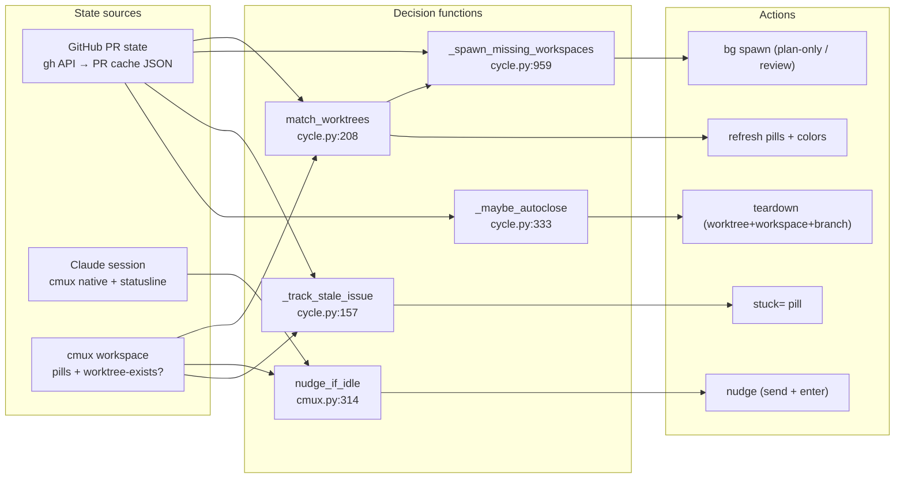
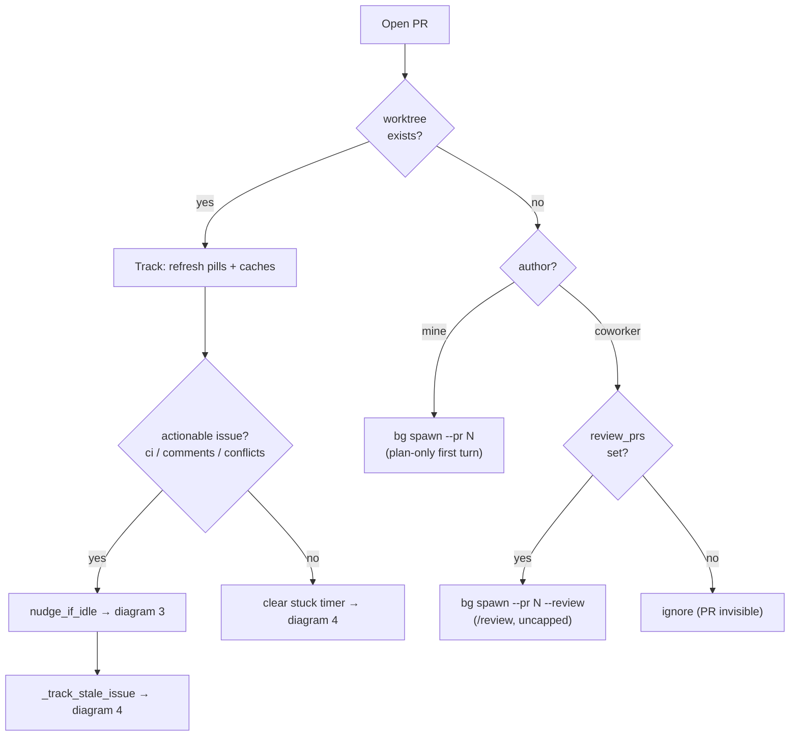
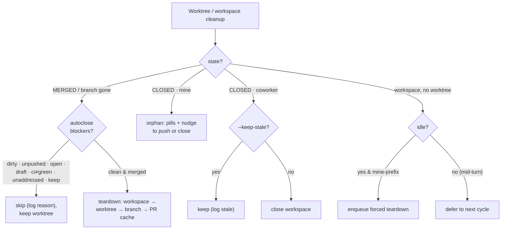
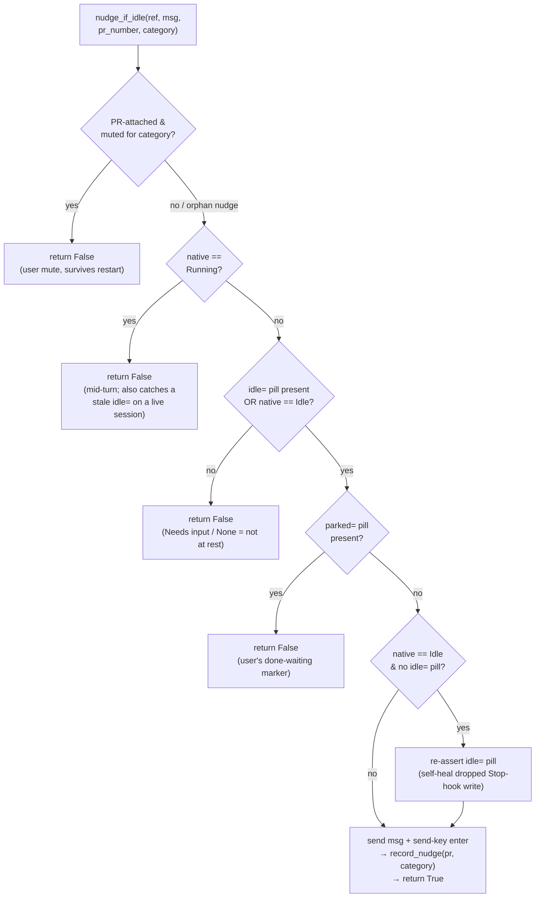
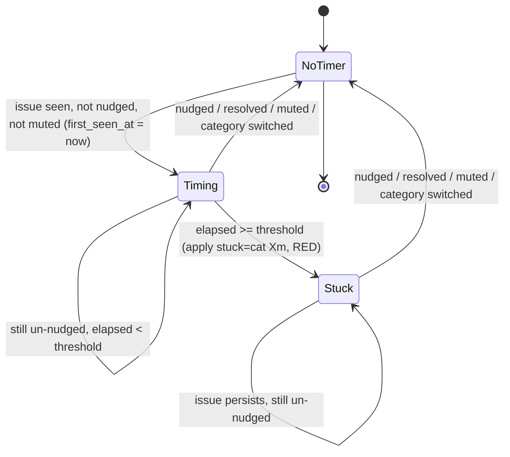
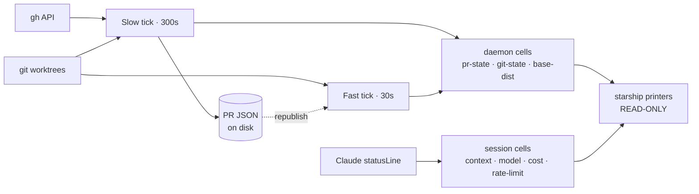

# Cockpit state machine

Cockpit combines **three independent state vocabularies** into per-workspace
decisions. No single source file shows the combination layer — this document
does. Diagrams are [Mermaid](https://mermaid.js.org/) and render on GitHub.

## The three state sources

| Source | Lives in | Values |
|---|---|---|
| **GitHub PR** | `gh` API → PR cache JSON (`cache.py`) | `state` ∈ {`OPEN`,`MERGED`,`CLOSED`} × `ci` × `unaddressed` × `review_decision` × `isDraft` × `mergeable` |
| **Claude session** | cmux native `claude_code=` + statusline stdin (`claude.py`) | `Running` / `Idle` / `Needs input`; context %, rate-limit, model, cost |
| **cmux workspace** | cmux pills + in-memory `pill_state` dict | `idle=` `stuck=` `parked=` `ci=` `comments=` `merge=` `wip=` `draft=` `approved=` `keep=` `stale=` `loop=` + *does a worktree exist?* |

Five decision functions consume these and emit actions. Everything below is a
drill-down of one node in the orientation map.

---

## 1. Orientation map (L0)

How the three state sources feed the five decision functions, and what each emits.

The renderer (`starship.py`) is **not** in this picture by design: it only reads
cache cells and never consults source state. See diagram 5.

---

## 2. Reconcile decision tree (slow tick)

Runs every `slow_poll_interval_seconds` (default 300s) in
`cycle.py::cycle_all`. For each PR crossed with "does a worktree exist?", the
daemon picks exactly one path. Split into two flows: **live PRs** (open work, may
spawn) and **cleanup** (merged/closed/orphaned). `self_user` is the configured
GitHub handle.

### 2a. Live PRs — track & spawn

Leads on "does a worktree exist?" so the two PR×author dimensions don't fan out.

### 2b. Cleanup — teardown, orphan, reap

Key gates (all from `cycle.py`):

- **Autoclose hard blocker** (never overridden): uncommitted files.
- **Autoclose soft blockers** (`forced=True` overrides): unpushed commits, open PR.
- **Autoclose smart-skip**: even when merged & clean, skip if draft, CI not green,
  or unaddressed review threads remain.
- **In-flight spawn guard**: `_bg_spawn_pr` keys `spawn:<owner>/<name>:<branch>`
  in `pill_state` with a `time.monotonic()` stamp; a second spawn within
  `_SPAWN_INFLIGHT_TTL_SECONDS` (600s) is skipped, so a `/cockpit:sync` kick
  can't double-launch mid-creation.
- **Orphan auto-spawn is `<self_user>/`-prefix gated**: review worktrees are
  never orphan-spawned.

---

## 3. Nudge idle-gate (`nudge_if_idle`, `cmux.py:314`)

Five sequential guards decide whether it is safe to `send` a nudge. The subtle
rule: cmux native `Needs input` is **deliberately untrusted** — it is the same
value cmux shows for a pending y/n permission prompt, and nudging there would
type into the confirmation. Do not "simplify" the gate to trust it.

There is **no time-based throttle**; the slow-tick cadence is the implicit rate
limit. Each tick re-evaluates and re-fires if the underlying issue persists.

Truth table (native × `idle=` × `parked=` × muted → result):

| native | `idle=` | `parked=` | muted | result |
|---|---|---|---|---|
| `Running` | any | any | any | **no** (guard 2) |
| `Idle` | T | F | F | **NUDGE** |
| `Idle` | F | F | F | **NUDGE** (+ self-heal `idle=`) |
| `Idle` | any | T | — | **no** (guard 4) |
| `Idle`/`None` | any | any | T | **no** (guard 1) |
| `Needs input` | any | any | any | **no** (guard 3, ambiguous) |
| `None` | T | F | F | **NUDGE** |
| `None` | F | any | any | **no** (guard 3) |

---

## 4. Stuck-pill timer (`_track_stale_issue`, `cycle.py:157`)

The `stuck=` pill is the **stale-running escape hatch**: a passive sidebar
visual (never a `send`) for when an actionable issue persists but the workspace
never becomes nudgeable — agent wedged mid-turn, or every `idle=` self-heal
failed. Per-category timing lives in `NudgePref.first_seen_at` (one JSON file
per PR). Threshold = `nudge_stale_seconds`, default `3 × slow_poll_interval`
(900s).

Reset paths (any of these clears the timer and pill):

- A successful nudge that cycle (`nudged=True`).
- The actionable issue resolves (`category=None`).
- User mutes the category (`should_nudge` returns False).
- The issue switches category (e.g. `ci` → `comments`); the old category's
  timer is dropped so it can't false-escalate.

The pill is managed **directly in the slow tick**, not via `apply_pills`, so it
is intentionally absent from `cmux.ACTIONABLE_KEYS`. No-op in dry runs.

---

## 5. Cell data-flow & ownership

**Only the daemon writes cells; renderers only read.** Field printers in
`starship.py` are strictly read-only — no `gh`, no `git`, no subprocess forks.
The lone exception is **session-scoped cells**, which Claude Code's statusLine
writes directly because the data exists only in the real-time stdin stream.

Read it left-to-right as a pipeline: **sources → ticks → cells → renderer**. The
daemon owns the bottom track; the statusLine is the side-channel that writes
session cells directly. The only feedback edge is the fast tick's republish loop
(it reads the persistent PR JSON and re-derives the ephemeral cells). `cmux`
pills are a separate daemon→cmux output (see diagram 1), not a render cell.

The cell-key detail (per-branch / per-cwd / per-sid suffixes) lives in the
source; this view shows ownership. Everything the renderer reads passes through
a cell — it never touches a source directly.

Why two ticks:

- **Slow tick** owns every decision (spawn, nudge, stuck, teardown, colors) and
  the expensive `gh` fetch + per-PR JSON snapshot.
- **Fast tick** is network-free: it re-derives git-state cells for every
  worktree and republishes PR flat cells from the persistent JSON, so a
  `git checkout` or an OS tmpdir wipe recovers within ~30s instead of ~300s.

Both hold `_tick_lock` (`daemon.py`) so they never collide on the same cells.

**Invariant**: a new cell's writer goes in `cache.py`; the call site goes in the
slow tick (decision + snapshot) and/or the fast tick (republish). Never let a
renderer path consult source state directly — that produces same-render
disagreement between fields, the bug class this design eliminates. Do not extend
the session-scoped exception to any new cell.
