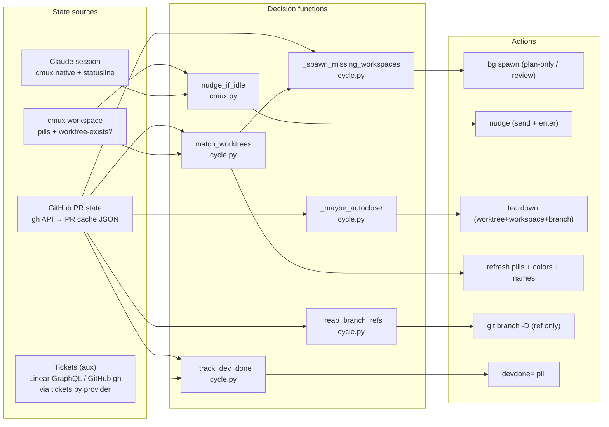
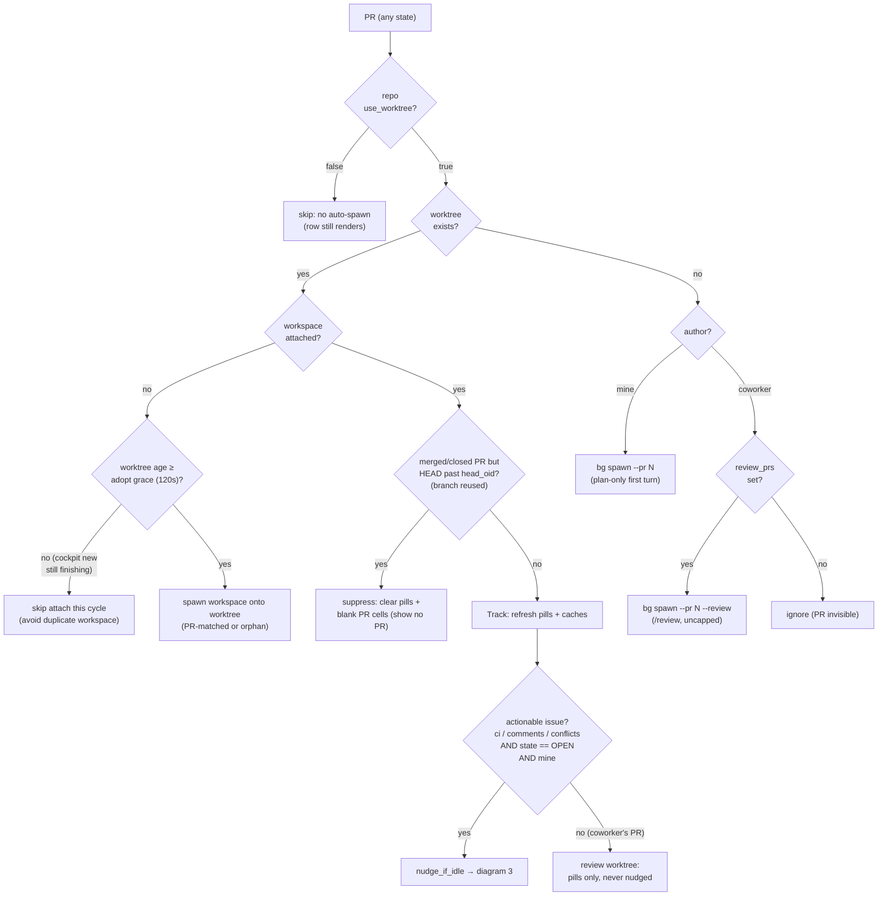
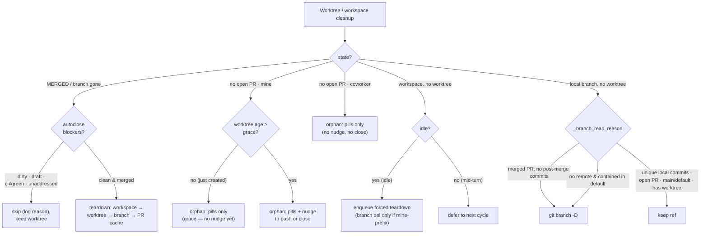
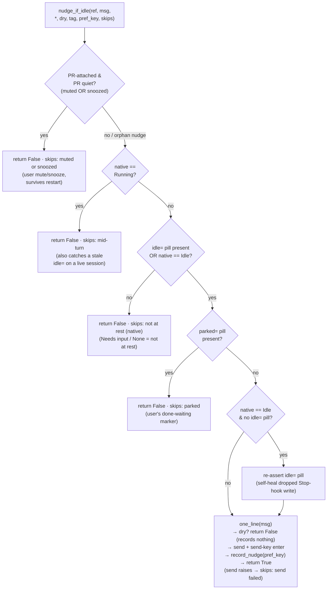
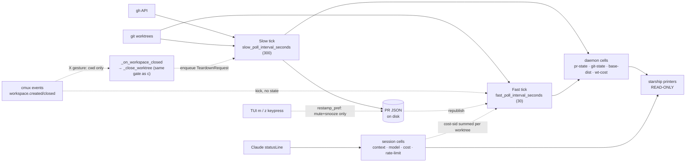

# Cockpit state machine

Cockpit combines **three independent state vocabularies** (plus an auxiliary
ticket-provider read) into per-workspace decisions. No single source file shows
the combination layer — this document does. Diagrams are
[Mermaid](https://mermaid.js.org/) and render on GitHub.

## The short version

Every cycle, cockpit asks one question per worktree: **does anything need to
happen here?**

Three sources answer it, all re-derived from scratch each time — nothing about
them is stored, so nothing can drift:

- **GitHub** — is there a PR, is it open, is CI green, are threads unresolved?
- **cmux** — is a session open on this worktree, and is it idle or mid-turn?
- **git** — does the worktree exist, is it dirty, how far behind its base?

Cross those and exactly one path applies: spawn a workspace, nudge the agent,
write a pill, tear the worktree down, or do nothing. Most cycles it is nothing.

Two ticks split the work. The **slow tick** (`slow_poll_interval_seconds`,
default 300) makes every decision and pays for the `gh` fetch. The **fast tick**
(`fast_poll_interval_seconds`, default 30) is network-free — it republishes what
the slow tick already decided, so a `git checkout` or a tmpdir wipe recovers on
the next fast tick rather than waiting out a slow one.

One rule governs the whole picture: **only the daemon writes cache cells;
renderers only read them.** A renderer that consults `git` or `gh` directly can
disagree with the field beside it in the same render, and that is the bug class
this design exists to eliminate.

**The four diagrams:** [orientation map](#1-orientation-map-l0) — sources to
decisions to actions · [reconcile tree](#2-reconcile-decision-tree-slow-tick) —
which path a PR × worktree pair takes ·
[nudge gate](#3-nudge-idle-gate-nudge_if_idle-cmuxpy) — the five guards before a
`send` · [cell data-flow](#4-cell-data-flow--ownership) — who writes what.

## The state sources

| Source | Lives in | Values |
|---|---|---|
| **GitHub PR** | `gh` API → PR cache JSON (`cache.py`) | `state` ∈ {`OPEN`,`MERGED`,`CLOSED`} × `ci` × `unaddressed` × `review_decision` × `isDraft` × `mergeable` |
| **Claude session** | cmux native `claude_code=` + statusline stdin (`claude.py`) | `Running` / `Idle` / `Needs input`; context %, rate-limit, model, cost |
| **cmux workspace** | cmux pills + in-memory `pill_state` dict | `idle=` `devdone=` `parked=` `ci=` `comments=` `merge=` `wip=` `draft=` `approved=` `stale=` `loop=` + *does a worktree exist?* |
| **Tickets** (aux) | the `tickets` provider (`tickets.py` → `linear.py` GraphQL or `github_issues.py` `gh`) | Linear ticket `state.name` (`Dev Done`) or GitHub issue label/state — read-only, drives the `devdone=` pill (and the opt-in done-on-merge write) |

The decision functions consume these and emit actions. Everything below is a
drill-down of one node in the orientation map.

---

## 1. Orientation map (L0)

How the state sources feed the decision functions, and what each emits.

```mermaid
flowchart LR
  subgraph SRC["State sources"]
    GH["GitHub PR state<br/>gh API → PR cache JSON"]
    CL["Claude session<br/>cmux native + statusline"]
    CM["cmux workspace<br/>pills + worktree-exists?"]
    LIN["Tickets (aux)<br/>Linear GraphQL / GitHub gh<br/>via tickets.py provider"]
  end

  subgraph DEC["Decision functions"]
    MW["match_worktrees<br/>cycle.py"]
    SM["_spawn_missing_workspaces<br/>cycle.py"]
    NI["nudge_if_idle<br/>cmux.py"]
    DD["_track_dev_done<br/>cycle.py"]
    AC["_maybe_autoclose<br/>cycle.py"]
    BR["_reap_branch_refs<br/>cycle.py"]
  end

  subgraph ACT["Actions"]
    A1["bg spawn (plan-only / review)"]
    A2["nudge (send + enter)"]
    A4["teardown (worktree+workspace+branch)"]
    A5["refresh pills + colors + names"]
    A6["git branch -D (ref only)"]
    A7["devdone= pill"]
  end

  GH --> MW & SM & AC & BR
  GH --> DD
  CM --> MW & NI
  CL --> NI
  LIN --> DD

  MW --> SM
  SM --> A1
  NI --> A2
  AC --> A4
  MW --> A5
  BR --> A6
  DD --> A7
```

The renderer (`starship.py`) is **not** in this picture by design: it only reads
cache cells and never consults source state. See diagram 4.

---

## 2. Reconcile decision tree (slow tick)

Runs every `slow_poll_interval_seconds` (default 300s) in
`cycle.py::cycle_all`. For each PR crossed with "does a worktree exist?", the
daemon picks exactly one path. Split into two flows: **live PRs** (open work, may
spawn) and **cleanup** (merged/closed/orphaned). `self_user` is the configured
GitHub handle.

### 2a. Live PRs — track & spawn

Leads on "does a worktree exist?" so the two PR×author dimensions don't fan out.
A `use_worktree: false` repo (registered by bare `cockpit new`) never reaches
this tree — `_spawn_missing_workspaces` early-returns, so no PR/review/orphan
worktree is auto-spawned; its row still renders from `git worktree list` + the
cell writers (and only while a workspace is open on it).

A repo **parked** with the TUI's `h` key drops out one level higher still:
`cycle_all` filters it before the per-repo loop, so nothing below runs for it —
no `gh` fetch, no cells, no spawn, no nudge, no ticket write. The one exception
is a scoped `only_repo` run (a `cockpit close` from inside a parked worktree),
which reconciles it regardless.

```mermaid
flowchart TD
  P["PR (any state)"] --> IP{"repo<br/>use_worktree?"}
  IP -->|"false"| SKIP["skip: no auto-spawn<br/>(row still renders)"]
  IP -->|"true"| WT{"worktree<br/>exists?"}

  WT -->|yes| WS{"workspace<br/>attached?"}
  WS -->|no| AGE{"worktree age ≥<br/>adopt grace (120s)?"}
  AGE -->|"no (cockpit new<br/>still finishing)"| WAIT["skip attach this cycle<br/>(avoid duplicate workspace)"]
  AGE -->|yes| ATT["spawn workspace onto worktree<br/>(PR-matched or orphan)"]

  WS -->|yes| REUSE{"merged/closed PR but<br/>HEAD past head_oid?<br/>(branch reused)"}
  REUSE -->|yes| SUP["suppress: clear pills +<br/>blank PR cells (show no PR)"]
  REUSE -->|no| TRACK["Track: refresh pills + caches"]
  TRACK --> ACT{"actionable issue?<br/>ci / comments / conflicts<br/>AND state == OPEN<br/>AND mine"}
  ACT -->|yes| NUDGE["nudge_if_idle → diagram 3"]
  ACT -->|"no (coworker's PR)"| RONLY["review worktree:<br/>pills only, never nudged"]

  WT -->|no| WHO{"author?"}
  WHO -->|mine| SP["bg spawn --pr N<br/>(plan-only first turn)"]
  WHO -->|coworker| RV{"review_prs<br/>set?"}
  RV -->|yes| SPR["bg spawn --pr N --review<br/>(/review, uncapped)"]
  RV -->|no| IG["ignore (PR invisible)"]
```

### 2b. Cleanup — teardown, orphan, reap

```mermaid
flowchart TD
  C["Worktree / workspace cleanup"] --> K{"state?"}

  K -->|"MERGED / branch gone"| AC{"autoclose<br/>blockers?"}
  AC -->|"dirty · draft ·<br/>ci≠green · unaddressed"| SK["skip (log reason),<br/>keep worktree"]
  AC -->|"clean & merged"| TD["teardown: workspace →<br/>worktree → branch → PR cache"]

  K -->|"no open PR · mine"| OG{"worktree age ≥<br/>grace?"}
  OG -->|"no (just created)"| OP["orphan: pills only<br/>(grace — no nudge yet)"]
  OG -->|"yes"| OR["orphan: pills + nudge<br/>to push or close"]

  K -->|"no open PR · coworker"| OC["orphan: pills only<br/>(no nudge, no close)"]

  K -->|"workspace, no worktree"| RP{"idle?"}
  RP -->|"yes (idle)"| EN["enqueue forced teardown<br/>(branch del only if mine-prefix)"]
  RP -->|"no (mid-turn)"| DF["defer to next cycle"]

  K -->|"local branch, no worktree"| BR{"_branch_reap_reason"}
  BR -->|"merged PR, no post-merge commits"| BD["git branch -D"]
  BR -->|"no remote & contained in default"| BD
  BR -->|"unique local commits ·<br/>open PR · main/default · has worktree"| BK["keep ref"]
```

Key gates (all from `cycle.py`):

- **Merged/closed PRs are never actionable**: a tracked worktree can map to a
  non-OPEN PR (autoclose keeps a merged-with-red-CI worktree for inspection —
  the smart-skip below). Its `ci`/`comments`/`conflicts` can no longer be
  resolved, so `actionable` is gated on `state == "OPEN"`; otherwise the nudge
  would loop forever (the issue never clears). The footer pill still shows the
  state; only the nudge is suppressed.
- **A coworker's PR is never nudged** (`PR.mine`): a tracked coworker worktree
  exists to *review* (`review_prs` auto-spawn, or a manual checkout), so the
  author-mode nudge text — "fix the failing CI", "rebase and force-push" —
  would aim a review session at rewriting someone else's branch. Same shape as
  the OPEN gate: pills and cells still render the issue, only the nudge (and
  its 🔔) is suppressed. Its seeded first turn is review-mode too
  (`build_pr_prompt` → `review.txt`, no `pr_authority` block).
- **Reused-branch suppression** (`_is_reused_branch_merge`): a merged/closed PR
  whose `headRefOid` is no longer an ancestor of the worktree's HEAD means the
  branch was reused for new local work. The card shows no PR until a new one is
  opened — the slow tick clears the pills, blanks the branch-keyed flat cells,
  and persists `reusedBranch: true` in the PR JSON so the git-free read paths
  (fast-tick republish, renderer refresh) stay blank without re-running `git`.
  An absent `headRefOid` (old cached PR) never suppresses, so a real PR is never
  hidden. The persistent JSON snapshot is kept — autoclose/teardown still read
  it; only the *display* is suppressed.
- **Autoclose hard blocker** (never overridden): uncommitted files.
- **Autoclose smart-skip**: even when merged & clean, skip if draft, CI not green,
  or unaddressed review threads remain.
- **Unlanded commits / open-PR are NOT autoclose blockers** — `_maybe_autoclose`
  only fires on a merged PR and tears down with `forced=True`; unlanded commits
  merely preserve the local branch ref. The unlanded / open-PR gate lives in
  `probe_blockers` (the TUI `c` close path), where `C` force overrides the open-PR
  soft block but never uncommitted/unlanded work.
- **The hard commit gate is ownership-split** (`worktree_state_blockers`) —
  **our** branch uses `git.count_unlanded`: commits flagged by BOTH a patch-id
  check against `origin/<default>` (`git cherry`, so a cherry-picked commit reads
  as landed) AND reachability from no remote ref other than `origin/<branch>`
  (so the commits of whatever branch this one is *stacked on* drop out — a
  `origin/<default>` baseline alone counted them, making every non-default-based
  branch permanently unclosable). Pushing does **not** clear it: a pushed-but-
  unmerged branch keeps its worktree. **Someone else's** branch (`is_mine=False`,
  a PR checked out for review) uses `git.commits_only_local` instead — their work
  is safe on `origin/<branch>` and the review is done, so only a local review
  fixup of ours blocks.
- **Primary-checkout close branches on the checkout's branch** — a manual `c`/`C`
  on a primary checkout (a `use_worktree: false` repo, `worktree_path == repo_path` /
  `wt.is_primary`) **always** skips `git worktree remove` (git refuses it on a
  primary checkout, and the user works there in place), then splits:
  - **On its default branch** → *workspace-only close*: the commit guard relaxes
    (`worktree_state_blockers(is_primary=True)` — the checkout and its branch stay,
    so unlanded commits are safe), leaving only the dirty guard.
  - **On a non-default (feature) branch** → *branch teardown*: after the workspace
    close, HEAD moves back to the default branch (`checkout_branch`) and the feature
    ref is deleted (`delete_local_branch`). The commit guard is **not** relaxed
    here (the branch is going away), so callers pass `is_primary = wt.is_primary and
    on_default` to the blockers (`on_default` via `origin_head_branch`; unknown
    default keeps it workspace-only) and set `delete_branch = pr_is_merged or
    (wt.is_primary and not on_default)`. The checkout+delete is soft-fail.

  This is a *manual* path only; the autoclose tree above never reaches a
  `use_worktree: false` repo.
- **Manual close is squash/rebase-merge aware** — the merged/open state both the
  hard commit gate and the soft open-PR gate read comes from
  `teardown.resolve_pr_state`: the cached PR payload first, then ONE live
  `gh pr list --head <branch> --state all` (`gh.fetch_pr_state_for_branch`) when
  the cache doesn't already say MERGED. This catches an out-of-band squash/rebase
  merge the slow tick never discovered — `git.count_unlanded` can't recognize a
  squash (N commits → one upstream commit, new sha and a combined patch-id), so
  without the live lookup the branch false-reads as unlanded, a HARD block `C`
  cannot override.
  The live call runs only on a deliberate `c`/`C` keypress (and the daemon's
  re-check in `teardown`), never per tick — mirroring how `_maybe_autoclose` uses
  `is_ancestor(wt, headRefOid)` rather than the commit count.
- **A merged PR is the only reaper**: `_handle_orphans_and_close_stale` never
  closes a worktree — a no-open-PR worktree (research/planning, or a coworker
  branch reviewed locally) gets orphan pills and lives until the user closes it
  (TUI `c`). Only `_maybe_autoclose` (merged & clean) tears anything down. There
  is no `keep` flag — with non-merge closing gone, nothing needs protecting.
- **Orphan-nudge grace** (`config.orphan_nudge_grace_seconds`, default 4h,
  per-repo over global, `0` disables): a freshly-spawned worktree has the exact
  no-commits / no-PR shape the orphan nudge targets, so `_refresh_orphan` skips
  the "push or close" nudge until the worktree's filesystem age
  (`git.worktree_age_seconds`, birthtime-based) clears the grace. Pills still
  apply during grace; only the `send` is held. Age is the *worktree's*, not the
  branch's or HEAD commit's — an empty branch sits at the old base tip, so commit
  date would mis-read "just created" as ancient.
- **In-flight spawn guard**: `_bg_spawn_pr` keys `spawn:<owner>/<name>:<branch>`
  in `pill_state` with a `time.monotonic()` stamp; a second spawn within
  `_SPAWN_INFLIGHT_TTL_SECONDS` (600s) is skipped, so a manual slow-tick kick
  (the `s` key, or a `cockpit close`/`new` SIGUSR1) can't double-launch
  mid-creation.
- **Adoption grace** (`_too_young_to_adopt`, `_SPAWN_ADOPT_GRACE_SECONDS` = 120s,
  not configurable): the in-flight guard above is a daemon-process-local dict, so
  it cannot see a *user-typed* `cockpit new` at all. That command creates the
  worktree and its workspace as two steps of a separate process, so a poll
  landing between them sees a worktree no workspace covers and attaches a second
  one — two Claude sessions on one worktree, same seeded task. Both attach paths
  (`spawn_pr_workspace` on a matched PR, `spawn_orphan_workspace`) therefore skip
  a worktree whose filesystem age (`git.worktree_age_seconds`, the same
  birthtime read as the orphan-nudge grace) is under the window. Only the
  *attach* is deferred; pills, cells and tracking are untouched. An unstattable
  path reads `inf` and spawns — it fails open.
- **Orphan auto-spawn is `<self_user>/`-prefix gated**: review worktrees are
  never orphan-spawned. It is deduped by **path** (skip if the worktree's path
  is already a workspace cwd) and additionally **name-clash gated**: skip + log
  if a workspace with the same short name already exists at a different,
  still-existing path. Without the name gate, two repos each holding a `foo`
  branch with no PR would churn — cmux allows duplicate names and the path
  dedup never covers the second repo's path, so a duplicate-named workspace
  would respawn every cycle. Dead-cwd workspaces don't suppress (they're reaped
  by `close_gone_cwd_workspaces`).
- **Branch-ref reap** (`_reap_branch_refs`): autoclose only iterates existing
  worktrees, so a branch whose worktree is gone keeps its dangling ref. The reap
  `git branch -D`s any worktree-less local branch that is either merged (unbounded
  `merged_branches_deep`) with no post-merge commits, or has no remote and is
  contained in `origin/<default>`. Keeps unique-commit, open-PR, main/default, and
  unverifiable branches. Unconditional cleanup, like `_maybe_autoclose`.
- **`cycle_repo` runs three capability tiers, gated per step in one fixed order**
  (the order is identical across backends, so cmux behaves exactly as before;
  non-cmux backends just skip the tiers they can't run):
  - **Backend-agnostic** (cmux, limux, **and** none) — pure git + Linear:
    `_transition_merged_tickets` (`tickets.close_on_merge`),
    `_reconcile_worktree_lifecycle` (autoclose-on-merge + stale-branch-ref reap),
    and the main-branch fast-forward. `cycle_all`'s close-request drain
    (`_drain_close_requests` — the TUI `c`/`C` path) is likewise unconditional.
  - **Workspace-capable** (`has_workspace_backend` → cmux + limux, not none):
    `_spawn_missing_workspaces` (+ `review_prs` discovery), `_run_repo_skills`,
    and the dead-cwd sweep `close_gone_cwd_workspaces`. These need a tool's
    spawn/close (best-effort, `check=False`) but not pills — limux has both verbs.
  - **cmux-only** (`not ctx.headless` ⇔ `is_cmux`): pills
    (`_refresh_tracked_pills`, orphan/wip/stale), colors (`_apply_repo_colors`),
    sidebar folds (`_reconcile_sidebar_groups` — stacks derived from `PR.base`
    via `stacks.find_stacks`, reconciled against cmux's live
    `workspace-group list`, never stored; it also collects the repo's
    `not PR.mine` workspaces and its snoozed ones (`NudgePref.snoozed`) into the
    `ReviewFolds` accumulator that the repo-spanning `_reconcile_review_groups`
    drains at the end of `cycle_all` into two trailing folds per org —
    `<org> reviews (N)` above `<org> snoozed (N)`, each created collapsed since
    both piles are by definition not-my-turn; create-time only, so a fold the
    user expands stays open — and then re-parks `folds.sunk`, the stack groups
    the per-repo pass sank for a snoozed tip, below both piles),
    `_dedupe_workspaces` (scoped to workspaces whose cwd resolves under this
    repo's worktrees — a foreign repo's same-named workspace is never grouped or
    closed; sorts by the PID in cmux `workspace:<pid>` refs — limux refs are
    UUIDs), focus, nudges, and the orphan-workspace reaper
    (`_reap_workspace_orphans` — its idle-safety gate reads the cmux-only `idle=`
    pill, so on limux it could only ever defer).

  So a limux daemon does everything except render pills/colors and nudge/focus.
  (Before, `cycle_repo`'s single `if ctx.headless: return` ran *before* all of
  this, so limux wrote only the statusline cache — every merged worktree, Linear
  transition, and fast-forward was stranded.)

---

## 3. Nudge idle-gate (`nudge_if_idle`, `cmux.py`)

Five sequential guards decide whether it is safe to `send` a nudge. The subtle
rule: cmux native `Needs input` is **deliberately untrusted** — it is the same
value cmux shows for a pending y/n permission prompt, and nudging there would
type into the confirmation. Do not "simplify" the gate to trust it.

```mermaid
flowchart TD
  IN["nudge_if_idle(ref, msg,<br/>*, dry, tag, pref_key, skips)"] --> G1{"PR-attached &<br/>PR quiet?<br/>(muted OR snoozed)"}
  G1 -->|yes| F1["return False · skips: muted or snoozed<br/>(user mute/snooze,<br/>survives restart)"]
  G1 -->|"no / orphan nudge"| G2{"native ==<br/>Running?"}

  G2 -->|yes| F2["return False · skips: mid-turn<br/>(also catches a stale<br/>idle= on a live session)"]
  G2 -->|no| G3{"idle= pill present<br/>OR native == Idle?"}

  G3 -->|no| F3["return False · skips: not at rest (native)<br/>(Needs input / None = not at rest)"]
  G3 -->|yes| G4{"parked= pill<br/>present?"}

  G4 -->|yes| F4["return False · skips: parked<br/>(user's done-waiting marker)"]
  G4 -->|no| HEAL{"native == Idle<br/>& no idle= pill?"}

  HEAL -->|yes| SELFHEAL["re-assert idle= pill<br/>(self-heal dropped Stop-hook write)"]
  HEAL -->|no| FIRE
  SELFHEAL --> FIRE["one_line(msg)<br/>→ dry? return False (records nothing)<br/>→ send + send-key enter<br/>→ record_nudge(pref_key) → return True<br/>(send raises → skips: send failed)"]
```

**The three middle guards live in `cmux._idle_skip_reason`**, not inline: a
caller that wants to *report* the verdict (`cockpit broadcast`'s per-workspace
summary) must not re-derive it from a second `list-status` — that would be both a
wasted round-trip and a second copy of a rule that must never drift from this
one. Its guard order is the diagram's: `Running` outranks the at-rest check,
which outranks `parked=`, so a mid-turn parked workspace reports `mid-turn`.

**`skips` is an optional out-dict** — on a gate skip it gets `{ref: reason}`,
using the strings above (they are user-facing). The `dry` path is the one
`return False` that records *nothing*, and that asymmetry is load-bearing:
absence from `skips` is what lets a caller read a False as "this one would have
received it". Passing no dict leaves behaviour byte-identical.

There is **no time-based throttle**; the slow-tick cadence is the implicit rate
limit. Each tick re-evaluates and re-fires if the underlying issue persists.

**The message is collapsed to one line before the send** (`cmux.one_line`), and
this is delivery correctness, not cosmetics. `cmux send` synthesizes keypresses
rather than doing a bracketed paste: both a real newline and the literal
two-character `\n` arrive as **Enter** (cmux's own help says so; probed against
0.64.22). An un-normalized multi-line message therefore submits its first
fragment as a truncated prompt and the remainder as a second one — which is what
`cockpit broadcast 'fix the \n handling'` used to do to every idle session. No
escape survives (`\\` arrives as two literal backslashes and the Enter still
fires), so collapsing is the only faithful delivery. It sits inside
`nudge_if_idle` — the single send funnel every caller already goes through — and
runs *before* the `dry` print, so `--dry` reports what would actually land.

Three callers reach this gate, all through the same door: the slow tick's PR
nudge (`cycle.py`, the only one passing `pref_key`), `cockpit broadcast`, and
the TUI's `a` (user-typed text, per row or per repo). The last two pass no
`pref_key`, so a deliberate gesture overrides mute/snooze while still honouring
every guard above. There is deliberately no manual *nudge* key: `N` sent a
canned catch-all through this same path and was removed — `a` already did
everything it added, and its preset was wrong on review rows, PR-less rows and
healthy ones (see the row-actions invariant in AGENTS.md).

`pref_key` is `nudges.pref_key(<repo nwo name>, <PR number>)`, not a bare PR
number: numbers are only unique within a repo, so a bare one made every repo
share one pref file (see the "Nudge prefs are keyed per repo" invariant).

Truth table (native × `idle=` × `parked=` × quiet → result), where **quiet** is
`NudgePref.muted or .snoozed` — the two user-set silences. They differ only in
how they end: a mute is indefinite (cleared by `m` / `cockpit nudge unmute`), a
snooze auto-clears the moment the PR's review activity changes or a *new*
actionable issue appears (`cycle._resolve_prefs` vs. `nudges.wake_signature` +
`NudgePref.wake_nudge`). Setting a snooze clears any mute, so the two never
coexist for long. Both look identical here.

| native | `idle=` | `parked=` | quiet | result |
|---|---|---|---|---|
| `Running` | any | any | any | **no** (guard 2) |
| `Idle` | T | F | F | **NUDGE** |
| `Idle` | F | F | F | **NUDGE** (+ self-heal `idle=`) |
| `Idle` | any | T | — | **no** (guard 4) |
| `Idle`/`None` | any | any | T | **no** (guard 1) |
| `Needs input` | any | any | any | **no** (guard 3, ambiguous) |
| `None` | T | F | F | **NUDGE** |
| `None` | F | any | any | **no** (guard 3) |

---

## 4. Cell data-flow & ownership

**Only the daemon writes cells; renderers only read.** Field printers in
`starship.py` are strictly read-only — no `gh`, no `git`, no subprocess forks.
The lone exception is **session-scoped cells**, which Claude Code's statusLine
writes directly because the data exists only in the real-time stdin stream.

Read it left-to-right as a pipeline: **sources → ticks → cells → renderer**. The
daemon owns the bottom track; the statusLine is the side-channel that writes
session cells directly. The only feedback edge is the fast tick's republish loop
(it reads the persistent PR JSON and re-derives the ephemeral cells). `cmux`
pills are a separate daemon→cmux output (see diagram 1), not a render cell.

```mermaid
flowchart LR
  GH["gh API"] --> SLOW["Slow tick<br/>slow_poll_interval_seconds (300)"]
  GIT["git worktrees"] --> SLOW
  GIT --> FAST["Fast tick<br/>fast_poll_interval_seconds (30)"]
  EV["cmux events<br/>workspace.created/closed"] -.kick, no state.-> FAST
  EV -.X gesture: cwd only.-> XCLOSE["_on_workspace_closed<br/>→ _close_worktree (same gate as c)"]
  XCLOSE -.enqueue TeardownRequest.-> SLOW

  SLOW --> DISK[("PR JSON<br/>on disk")]
  DISK -.republish.-> FAST
  KEY["TUI m / z keypress"] -.restamp_pref: mute+snooze only.-> DISK

  SLOW --> CELLS["daemon cells<br/>pr-state · git-state · base-dist · wt-cost"]
  FAST --> CELLS

  STDIN["Claude statusLine"] --> SESS["session cells<br/>context · model · cost · rate-limit"]
  SESS -.cost-sid summed per worktree.-> FAST

  CELLS --> RENDER["starship printers<br/>READ-ONLY"]
  SESS --> RENDER
```

The dotted `EV → XCLOSE` edge is the one place an event *payload* is read, and
it carries a gesture rather than state: clicking the ✕ on a cmux sidebar row is
the only close a user can make from outside the TUI, and derived inventory
cannot express it (a closed workspace and a not-yet-spawned one are the same
observable state). The payload contributes a `cwd` and nothing else — every fact
the teardown decision uses is still re-derived by `_close_worktree`, which is
the identical gate the `c` key runs, so a dirty tree / unpushed commits / an
open PR refuse loudly and the worktree survives (the next slow tick respawns its
workspace, the visible signal that nothing was torn down). cockpit's own closes
— `h`/park, a trailing-fold anchor dissolve, `close_gone_cwd_workspaces`, and
teardown's trailing close — are filtered first by the `cmux.was_self_closed`
ledger; without it, park (workspace-only by definition) would tear down every
worktree in the parked repo. See AGENTS.md's doorbell invariant.

The dotted `KEY → DISK` edge is the one write a row action makes. `pr-muted` and
`pr-snoozed` are the only cells the daemon does not derive — it reads them back
out of the pref file the `m`/`z` keypress just wrote — so waiting for the kicked
cycle to republish them was pure lag, and it read as a dropped keypress (`z`
leaving the row unfolded, unbanded, and the footer still saying "Snooze"). So both
toggles re-stamp the snapshot's two fields and their cells (`cache.restamp_pref`)
before kicking, writing exactly what the cycle would have written. Both halves
are needed: cells alone are reverted by the next fast tick's republish, which
reads the snapshot. Everything else the keypress implies (pills, the
trailing `snoozed` fold, the nudge going quiet) *is* derived and stays the
cycle's job. This does not generalize to a derived cell.

The dotted `SESS → FAST` edge is the one place the daemon *reads* a
session-scoped cell: `cost-<sid>` is keyed by Claude Code session while every
TUI row is keyed by worktree path, so the fast tick folds the sessions rooted at
each worktree into one `wt-cost` cell for the table's `$` column. It reads only
— session cells stay the statusLine's to write.

The cell-key detail (per-branch / per-cwd / per-sid suffixes) lives in the
source; this view shows ownership. Everything the renderer reads passes through
a cell — it never touches a source directly.

The **per-PR JSON** is the one read keyed by *repo* rather than branch/cwd: the
daemon writes `{nwo}__pr-N.json` (`cache._repo_slug`, `nwo = repo_nwo(path)[1]`),
so every reader — daemon *and* TUI/`cockpit close` — must resolve `find_pr_payload`
by that same git nwo, **not** the config `name` label (arbitrary/mutable; the two
differ e.g. label `Envesya` vs repo `beta`). The TUI memoizes the nwo per repo
(`app._cache_repo_name`) since `repo_nwo` shells out to `gh`. Keying by the label
misses every file → blank Ticket/Status cells and no-op row actions.

Why two ticks:

- **Slow tick** owns every decision (spawn, nudge, devdone, teardown,
  colors, names) and the expensive `gh` (+ optional ticket-provider) fetch + per-PR JSON
  snapshot. It processes repos serially, writing each repo's cells before
  fetching the next, and fires an `on_repo_done` hook after each one
  (`tui/app.py::_publish_inventory`) so the table republishes per-repo — a
  finished repo surfaces while later repos still round-trip `gh`, rather than all
  repos appearing at tick end. The hook is read-only (re-gather worktrees +
  re-render); it writes no cell.
- **Fast tick** is network-free: it re-derives git-state cells for every
  worktree, reconciles each workspace's name to its branch-derived label
  (`reconcile_workspace_names`) and its sidebar colour to the repo's
  `sidebar_color` (`_tint_repo_workspaces`), sums each worktree's session spend
  into its `wt-cost` cell (`write_worktree_cost_cache`), and republishes PR flat
  cells from the persistent JSON, so a `git checkout`, a drifted workspace name,
  a freshly spawned workspace's colour, a running agent's cost, or an OS tmpdir
  wipe recovers on the next fast tick rather than waiting out a slow one. That
  interval is the *floor*, not the only trigger: the
  `cmux events` doorbell (`lib/events.py`, cmux-only) kicks it the moment a
  workspace is created or closed, so a spawn or close lands immediately. The
  event carries **no state** — it only wakes the tick, which re-derives
  everything exactly as the timer would.

Both hold `_tick_lock` (`tui/app.py`) so they never collide on the same cells.

**Invariant**: a new cell's writer goes in `cache.py`; the call site goes in the
slow tick (decision + snapshot) and/or the fast tick (republish). Never let a
renderer path consult source state directly — that produces same-render
disagreement between fields, the bug class this design eliminates. Do not extend
the session-scoped exception to any new cell.
